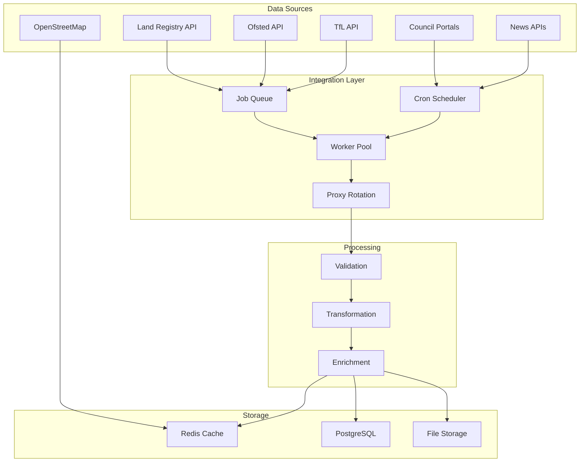

# API Integration Plan

## Overview

This document outlines the comprehensive strategy for integrating external data sources into the NW London Local Ledger platform. Our approach prioritizes data reliability, scalability, and compliance with rate limits while maintaining data freshness.

## Integration Architecture



## 1. Land Registry API Integration

### API Overview
- **Endpoint**: https://landregistry.data.gov.uk/
- **Data Available**: Property ownership, price paid data, transaction history
- **Rate Limits**: 600 requests per minute
- **Authentication**: API key required for bulk access

### Implementation Strategy

```javascript
// Land Registry API Client
class LandRegistryClient {
  constructor(config) {
    this.apiKey = config.apiKey;
    this.baseUrl = 'https://landregistry.data.gov.uk';
    this.rateLimiter = new RateLimiter({
      tokensPerInterval: 600,
      interval: 'minute'
    });
  }

  async getPricePaidData(postcode, dateFrom, dateTo) {
    await this.rateLimiter.consume(1);

    const params = new URLSearchParams({
      postcode: postcode,
      min_date: dateFrom,
      max_date: dateTo,
      format: 'json'
    });

    try {
      const response = await fetch(
        `${this.baseUrl}/price-paid?${params}`,
        {
          headers: {
            'Authorization': `Bearer ${this.apiKey}`,
            'Accept': 'application/json'
          }
        }
      );

      if (response.ok) {
        return await response.json();
      }

      throw new Error(`API error: ${response.status}`);
    } catch (error) {
      logger.error('Land Registry API error', { error, postcode });
      throw error;
    }
  }

  async getPropertyDetails(titleNumber) {
    await this.rateLimiter.consume(1);

    const cacheKey = `land_registry:property:${titleNumber}`;
    const cached = await redis.get(cacheKey);

    if (cached) {
      return JSON.parse(cached);
    }

    const response = await fetch(
      `${this.baseUrl}/property/${titleNumber}`,
      {
        headers: { 'Authorization': `Bearer ${this.apiKey}` }
      }
    );

    const data = await response.json();

    // Cache for 24 hours
    await redis.setex(cacheKey, 86400, JSON.stringify(data));

    return data;
  }
}
```

### Data Synchronization

```javascript
// Batch processing for Land Registry updates
class LandRegistrySyncJob {
  async execute() {
    const postcodes = await this.getTargetPostcodes();
    const batchSize = 10;

    for (let i = 0; i < postcodes.length; i += batchSize) {
      const batch = postcodes.slice(i, i + batchSize);

      await Promise.all(
        batch.map(async (postcode) => {
          try {
            const data = await this.client.getPricePaidData(
              postcode,
              moment().subtract(1, 'month').format('YYYY-MM-DD'),
              moment().format('YYYY-MM-DD')
            );

            await this.processTransactions(data);
          } catch (error) {
            await this.recordError(postcode, error);
          }
        })
      );

      // Respect rate limits
      await this.sleep(1000);
    }
  }

  async processTransactions(data) {
    for (const transaction of data.transactions) {
      // Match to existing property or create new
      const property = await this.matchOrCreateProperty(transaction);

      // Record sale
      await this.recordSale(property.id, transaction);

      // Update property valuation
      await this.updateValuation(property.id);
    }
  }
}
```

## 2. Council Planning Portal Scraping Strategies

### Target Councils

| Council | Portal Type | URL | Update Frequency |
|---------|------------|-----|-----------------|
| Camden | Idox | https://planningrecords.camden.gov.uk | Daily |
| Barnet | Idox | https://publicaccess.barnet.gov.uk | Daily |
| Brent | Northgate | https://pa.brent.gov.uk | Daily |
| Westminster | Idox | https://idoxpa.westminster.gov.uk | Daily |
| Harrow | Acolaid | https://planningsearch.harrow.gov.uk | Daily |
| Ealing | Northgate | https://pam.ealing.gov.uk | Daily |

### Scraping Architecture

```python
# Base scraper for council planning portals
import asyncio
from playwright.async_api import async_playwright
from bs4 import BeautifulSoup
import hashlib

class CouncilPlanningScr```python
class CouncilPlanningScraper:
    def __init__(self, council_config):
        self.config = council_config
        self.session_manager = SessionManager()
        self.proxy_rotator = ProxyRotator()

    async def scrape(self):
        async with async_playwright() as p:
            browser = await p.chromium.launch(
                headless=True,
                proxy=self.proxy_rotator.get_next()
            )

            context = await browser.new_context(
                user_agent=self.get_random_user_agent()
            )

            page = await context.new_page()

            try:
                # Navigate to search page
                await page.goto(self.config['search_url'])

                # Submit search for recent applications
                await self.submit_search(page)

                # Paginate through results
                applications = []
                has_next = True

                while has_next:
                    # Extract applications from current page
                    page_apps = await self.extract_applications(page)
                    applications.extend(page_apps)

                    # Check for next page
                    has_next = await self.navigate_next(page)

                    # Rate limiting
                    await asyncio.sleep(random.uniform(1, 3))

                # Process each application detail
                for app in applications:
                    await self.process_application(app, context)

            finally:
                await browser.close()

        return applications

    async def extract_applications(self, page):
        # Extract based on council-specific selectors
        if self.config['portal_type'] == 'idox':
            return await self.extract_idox_applications(page)
        elif self.config['portal_type'] == 'northgate':
            return await self.extract_northgate_applications(page)
        else:
            raise NotImplementedError(f"Unsupported portal type: {self.config['portal_type']}")

    async def extract_idox_applications(self, page):
        applications = []

        # Wait for results table
        await page.wait_for_selector('#searchresults', timeout=10000)

        # Extract table rows
        rows = await page.query_selector_all('#searchresults tbody tr')

        for row in rows:
            app_data = {
                'reference': await self.get_text(row, '.reference'),
                'address': await self.get_text(row, '.address'),
                'description': await self.get_text(row, '.description'),
                'status': await self.get_text(row, '.status'),
                'date_received': await self.get_text(row, '.date'),
                'detail_url': await self.get_href(row, '.reference a')
            }

            # Generate unique hash for deduplication
            app_data['hash'] = hashlib.md5(
                f"{app_data['reference']}{app_data['status']}".encode()
            ).hexdigest()

            applications.append(app_data)

        return applications

    async def process_application(self, app_summary, context):
        # Skip if already processed
        if await self.is_processed(app_summary['hash']):
            return

        # Create new page for detail view
        page = await context.new_page()

        try:
            await page.goto(app_summary['detail_url'])

            # Extract detailed information
            details = await self.extract_application_details(page)

            # Merge summary and details
            full_application = {**app_summary, **details}

            # Save to database
            await self.save_application(full_application)

            # Download documents
            await self.download_documents(full_application, page)

            # Mark as processed
            await self.mark_processed(app_summary['hash'])

        except Exception as e:
            logger.error(f"Error processing application {app_summary['reference']}", exc_info=e)
        finally:
            await page.close()

        # Rate limiting
        await asyncio.sleep(random.uniform(2, 5))
```

### Anti-Scraping Countermeasures

```python
class ScraperProtection:
    def __init__(self):
        self.user_agents = [
            'Mozilla/5.0 (Windows NT 10.0; Win64; x64) AppleWebKit/537.36',
            'Mozilla/5.0 (Macintosh; Intel Mac OS X 10_15_7) AppleWebKit/537.36',
            'Mozilla/5.0 (X11; Linux x86_64) AppleWebKit/537.36'
        ]

        self.proxies = self.load_proxy_list()
        self.session_cookies = {}

    def get_random_user_agent(self):
        return random.choice(self.user_agents)

    def rotate_proxy(self):
        proxy = random.choice(self.proxies)
        return {
            'server': f'http://{proxy["ip"]}:{proxy["port"]}',
            'username': proxy.get('username'),
            'password': proxy.get('password')
        }

    async def handle_cloudflare(self, page):
        # Wait for Cloudflare challenge
        await page.wait_for_selector('body', timeout=30000)

        # Check if Cloudflare challenge present
        if await page.query_selector('.cf-browser-verification'):
            logger.info('Cloudflare challenge detected, waiting...')
            await page.wait_for_navigation(timeout=30000)

    async def maintain_session(self, page):
        # Periodically refresh session to avoid timeouts
        await page.evaluate('() => { window.scrollBy(0, 100); }')
        await asyncio.sleep(0.5)
        await page.evaluate('() => { window.scrollBy(0, -100); }')

    def implement_backoff(self, attempt):
        # Exponential backoff with jitter
        base_delay = 2 ** attempt
        jitter = random.uniform(0, base_delay * 0.1)
        return min(base_delay + jitter, 60)  # Max 60 seconds
```

## 3. Local News Feed Aggregation

### News Sources

```yaml
news_sources:
  - name: Ham & High
    type: rss
    url: https://www.hamhigh.co.uk/news.rss
    categories: [local-news, property, planning]

  - name: Camden New Journal
    type: rss
    url: https://www.camdennewjournal.com/rss
    categories: [local-news, politics, community]

  - name: Barnet Times
    type: rss
    url: https://www.times-series.co.uk/news/barnet/rss
    categories: [local-news, crime, education]

  - name: Brent & Kilburn Times
    type: web_scrape
    url: https://www.kilburntimes.co.uk
    selectors:
      articles: .article-list-item
      title: .article-title
      content: .article-content
      date: .article-date

  - name: MyLondon - North West
    type: rss
    url: https://www.mylondon.news/news/north-london-news/rss
    categories: [news, transport, property]
```

### News Aggregation Pipeline

```javascript
class NewsAggregator {
  constructor() {
    this.sources = require('./config/news-sources.json');
    this.parser = new Parser();
    this.ai = new OpenAIClient();
  }

  async aggregateNews() {
    const articles = [];

    for (const source of this.sources) {
      try {
        let sourceArticles;

        if (source.type === 'rss') {
          sourceArticles = await this.fetchRSS(source);
        } else if (source.type === 'web_scrape') {
          sourceArticles = await this.scrapeWebsite(source);
        }

        // Process and enrich articles
        for (const article of sourceArticles) {
          const enriched = await this.enrichArticle(article, source);
          articles.push(enriched);
        }
      } catch (error) {
        logger.error(`Failed to fetch from ${source.name}`, error);
      }
    }

    return articles;
  }

  async fetchRSS(source) {
    const feed = await this.parser.parseURL(source.url);

    return feed.items.map(item => ({
      title: item.title,
      url: item.link,
      summary: item.contentSnippet,
      content: item.content,
      published: new Date(item.pubDate),
      source: source.name,
      categories: source.categories
    }));
  }

  async enrichArticle(article, source) {
    // Extract locations mentioned
    article.locations = await this.extractLocations(article.content);

    // Determine relevance to postcodes
    article.relevantPostcodes = this.mapLocationsToPostcodes(article.locations);

    // Generate AI summary if needed
    if (!article.summary) {
      article.summary = await this.generateSummary(article.content);
    }

    // Classify article
    article.classification = await this.classifyArticle(article);

    // Extract key entities
    article.entities = await this.extractEntities(article.content);

    return article;
  }

  async generateSummary(content) {
    const response = await this.ai.createCompletion({
      model: 'gpt-3.5-turbo',
      messages: [
        {
          role: 'system',
          content: 'Summarize this local news article in 2-3 sentences.'
        },
        {
          role: 'user',
          content: content
        }
      ],
      max_tokens: 100
    });

    return response.choices[0].message.content;
  }
}
```

## 4. School Ratings (Ofsted) Integration

### Ofsted Data Sources

```javascript
class OfstedIntegration {
  constructor() {
    this.dataUrl = 'https://www.compare-school-performance.service.gov.uk/api/';
    this.downloadUrl = 'https://www.gov.uk/government/statistical-data-sets/';
  }

  async syncSchoolData() {
    // Download latest Ofsted data file
    const dataFile = await this.downloadLatestDataset();

    // Parse CSV data
    const schools = await this.parseOfstedData(dataFile);

    // Process each school
    for (const school of schools) {
      await this.processSchool(school);
    }
  }

  async downloadLatestDataset() {
    // Ofsted publishes monthly datasets
    const response = await fetch(
      `${this.downloadUrl}monthly-management-information-ofsteds-school-inspections-outcomes`
    );

    const html = await response.text();
    const $ = cheerio.load(html);

    // Find latest CSV link
    const csvLink = $('.attachment-inline a[href$=".csv"]').first().attr('href');

    // Download CSV
    const csvResponse = await fetch(csvLink);
    const csvData = await csvResponse.text();

    return csvData;
  }

  async processSchool(schoolData) {
    // Match to our database
    const school = await this.matchSchool(schoolData);

    if (!school) {
      // Create new school entry
      await this.createSchool(schoolData);
    } else {
      // Update existing school
      await this.updateSchool(school.id, schoolData);
    }

    // Update catchment areas if needed
    await this.updateCatchmentArea(school);

    // Calculate area statistics
    await this.updateAreaSchoolStats(school.area_id);
  }

  async fetchSchoolPerformance(urn) {
    const response = await fetch(
      `${this.dataUrl}schools/${urn}/performance`
    );

    return await response.json();
  }
}
```

## 5. Rate Limiting and Caching Strategies

### Rate Limiter Implementation

```javascript
class RateLimitManager {
  constructor() {
    this.limits = {
      'land_registry': { requests: 600, window: 60 },
      'ofsted': { requests: 100, window: 60 },
      'tfl': { requests: 500, window: 60 },
      'council_camden': { requests: 60, window: 60 },
      'council_barnet': { requests: 60, window: 60 }
    };

    this.buckets = new Map();
  }

  async canMakeRequest(service) {
    const limit = this.limits[service];
    if (!limit) return true;

    const bucket = this.getBucket(service);
    return bucket.canConsume(1);
  }

  async consumeToken(service) {
    const bucket = this.getBucket(service);
    await bucket.consume(1);
  }

  getBucket(service) {
    if (!this.buckets.has(service)) {
      const limit = this.limits[service];
      this.buckets.set(service, new TokenBucket({
        capacity: limit.requests,
        fillPerSecond: limit.requests / limit.window
      }));
    }
    return this.buckets.get(service);
  }
}
```

### Caching Strategy

```javascript
class CacheManager {
  constructor(redis) {
    this.redis = redis;
    this.strategies = {
      'property_details': {
        ttl: 86400, // 24 hours
        prefix: 'prop:',
        invalidateOn: ['property_update', 'sale_recorded']
      },
      'planning_application': {
        ttl: 14400, // 4 hours
        prefix: 'plan:',
        invalidateOn: ['planning_update', 'status_change']
      },
      'area_stats': {
        ttl: 3600, // 1 hour
        prefix: 'area:',
        invalidateOn: ['new_sale', 'new_listing']
      },
      'school_data': {
        ttl: 604800, // 1 week
        prefix: 'school:',
        invalidateOn: ['ofsted_update']
      },
      'news_articles': {
        ttl: 900, // 15 minutes
        prefix: 'news:',
        invalidateOn: ['new_article']
      }
    };
  }

  async get(type, key) {
    const strategy = this.strategies[type];
    const cacheKey = `${strategy.prefix}${key}`;

    const cached = await this.redis.get(cacheKey);
    if (cached) {
      // Update access time for LRU
      await this.redis.expire(cacheKey, strategy.ttl);
      return JSON.parse(cached);
    }

    return null;
  }

  async set(type, key, value) {
    const strategy = this.strategies[type];
    const cacheKey = `${strategy.prefix}${key}`;

    await this.redis.setex(
      cacheKey,
      strategy.ttl,
      JSON.stringify(value)
    );
  }

  async invalidate(event, data) {
    // Find all cache types that should be invalidated
    for (const [type, strategy] of Object.entries(this.strategies)) {
      if (strategy.invalidateOn.includes(event)) {
        await this.invalidateType(type, data);
      }
    }
  }

  async invalidateType(type, data) {
    const strategy = this.strategies[type];
    const pattern = `${strategy.prefix}*`;

    // Use SCAN to find matching keys
    const stream = this.redis.scanStream({
      match: pattern,
      count: 100
    });

    stream.on('data', (keys) => {
      if (keys.length) {
        this.redis.del(keys);
      }
    });
  }

  async warmCache() {
    // Pre-populate cache with frequently accessed data
    const popularProperties = await this.getPopularProperties();
    for (const prop of popularProperties) {
      await this.set('property_details', prop.id, prop);
    }

    const activeApplications = await this.getActiveApplications();
    for (const app of activeApplications) {
      await this.set('planning_application', app.reference, app);
    }
  }
}
```

## 6. Transport Data Integration (TfL)

```javascript
class TfLIntegration {
  constructor() {
    this.apiKey = process.env.TFL_API_KEY;
    this.baseUrl = 'https://api.tfl.gov.uk';
  }

  async getStationData(lat, lon, radius = 1000) {
    const response = await fetch(
      `${this.baseUrl}/StopPoint?lat=${lat}&lon=${lon}&radius=${radius}&app_key=${this.apiKey}`
    );

    const data = await response.json();

    return data.stopPoints.map(stop => ({
      id: stop.id,
      name: stop.commonName,
      type: stop.modes,
      distance: stop.distance,
      lines: stop.lines,
      facilities: stop.additionalProperties
    }));
  }

  async getLineStatus() {
    const response = await fetch(
      `${this.baseUrl}/Line/Mode/tube,overground,dlr,tram/Status?app_key=${this.apiKey}`
    );

    return await response.json();
  }

  async calculateTransportScore(location) {
    const nearby = await this.getStationData(location.lat, location.lon);

    let score = 0;

    // Score based on proximity and variety of transport
    nearby.forEach(station => {
      const distanceScore = Math.max(0, 100 - (station.distance / 10));
      const modeMultiplier = station.type.includes('tube') ? 1.5 : 1;
      score += distanceScore * modeMultiplier;
    });

    return Math.min(100, score / nearby.length);
  }
}
```

## 7. Data Quality and Validation

```javascript
class DataValidator {
  constructor() {
    this.rules = {
      property: {
        required: ['address', 'postcode', 'latitude', 'longitude'],
        validators: {
          postcode: this.validatePostcode,
          price: this.validatePrice,
          coordinates: this.validateCoordinates
        }
      },
      planning: {
        required: ['reference', 'description', 'submitted_date'],
        validators: {
          reference: this.validatePlanningRef,
          status: this.validateStatus
        }
      }
    };
  }

  async validate(type, data) {
    const rules = this.rules[type];
    const errors = [];

    // Check required fields
    for (const field of rules.required) {
      if (!data[field]) {
        errors.push(`Missing required field: ${field}`);
      }
    }

    // Run validators
    for (const [field, validator] of Object.entries(rules.validators)) {
      if (data[field]) {
        const error = await validator(data[field]);
        if (error) {
          errors.push(`${field}: ${error}`);
        }
      }
    }

    return {
      valid: errors.length === 0,
      errors
    };
  }

  validatePostcode(postcode) {
    const regex = /^NW([1-9]|1[01])\s?\d[A-Z]{2}$/i;
    if (!regex.test(postcode)) {
      return 'Invalid NW London postcode';
    }
    return null;
  }

  validatePrice(price) {
    if (price < 10000 || price > 50000000) {
      return 'Price outside reasonable range';
    }
    return null;
  }

  validateCoordinates(coords) {
    // Check if within Greater London bounds
    const londonBounds = {
      north: 51.6919,
      south: 51.2867,
      east: 0.3340,
      west: -0.5103
    };

    if (coords.lat < londonBounds.south || coords.lat > londonBounds.north ||
        coords.lon < londonBounds.west || coords.lon > londonBounds.east) {
      return 'Coordinates outside London area';
    }
    return null;
  }
}
```

## 8. Error Handling and Recovery

```javascript
class IntegrationErrorHandler {
  constructor() {
    this.retryConfig = {
      maxAttempts: 3,
      backoffMultiplier: 2,
      maxBackoffMs: 30000
    };
  }

  async withRetry(fn, context) {
    let lastError;

    for (let attempt = 1; attempt <= this.retryConfig.maxAttempts; attempt++) {
      try {
        return await fn();
      } catch (error) {
        lastError = error;

        if (!this.isRetryable(error)) {
          throw error;
        }

        if (attempt < this.retryConfig.maxAttempts) {
          const delay = this.calculateBackoff(attempt);
          logger.warn(`Attempt ${attempt} failed, retrying in ${delay}ms`, {
            context,
            error: error.message
          });
          await this.sleep(delay);
        }
      }
    }

    throw new Error(`Failed after ${this.retryConfig.maxAttempts} attempts: ${lastError.message}`);
  }

  isRetryable(error) {
    // Network errors
    if (error.code === 'ECONNRESET' || error.code === 'ETIMEDOUT') {
      return true;
    }

    // HTTP status codes
    if (error.status) {
      // Retry on 429 (rate limit), 502-504 (gateway errors)
      return error.status === 429 || (error.status >= 502 && error.status <= 504);
    }

    return false;
  }

  calculateBackoff(attempt) {
    const delay = Math.min(
      1000 * Math.pow(this.retryConfig.backoffMultiplier, attempt - 1),
      this.retryConfig.maxBackoffMs
    );

    // Add jitter
    return delay + Math.random() * 1000;
  }

  async handleError(error, context) {
    // Log error
    logger.error('Integration error', {
      context,
      error: error.message,
      stack: error.stack
    });

    // Store in error queue for manual review
    await this.queueError({
      timestamp: new Date(),
      context,
      error: {
        message: error.message,
        code: error.code,
        status: error.status
      }
    });

    // Send alert if critical
    if (this.isCritical(error, context)) {
      await this.sendAlert(error, context);
    }
  }
}
```

## 9. Monitoring and Alerting

```yaml
monitoring:
  metrics:
    - name: api_request_count
      type: counter
      labels: [service, status]

    - name: api_response_time
      type: histogram
      labels: [service, endpoint]

    - name: scraping_success_rate
      type: gauge
      labels: [council]

    - name: data_freshness
      type: gauge
      labels: [data_type]
      alert:
        condition: value > 86400
        message: "Data older than 24 hours"

    - name: cache_hit_ratio
      type: gauge
      labels: [cache_type]

  alerts:
    - name: High API Error Rate
      condition: rate(api_request_count{status="error"}[5m]) > 0.1
      severity: warning
      channels: [slack, email]

    - name: Scraping Failure
      condition: scraping_success_rate < 0.5
      severity: critical
      channels: [slack, pagerduty]

    - name: Rate Limit Exceeded
      condition: rate(api_request_count{status="429"}[1m]) > 10
      severity: warning
      channels: [slack]

  dashboards:
    - name: API Integration Overview
      panels:
        - title: Request Rate
          query: rate(api_request_count[5m])
          type: graph

        - title: Error Rate
          query: rate(api_request_count{status="error"}[5m])
          type: graph

        - title: Response Times
          query: histogram_quantile(0.95, api_response_time)
          type: graph

        - title: Data Freshness
          query: data_freshness
          type: table
```

## 10. Implementation Timeline

### Phase 1: Core Integrations (Weeks 1-4)

**Week 1-2: Land Registry Integration**
- Set up API authentication
- Implement data fetching
- Build matching algorithm
- Create update jobs

**Week 3-4: Council Scraping Infrastructure**
- Build scraping framework
- Implement Camden scraper
- Set up proxy rotation
- Create data validation

### Phase 2: Extended Data Sources (Weeks 5-8)

**Week 5-6: Additional Council Scrapers**
- Implement Barnet scraper
- Implement Brent scraper
- Add remaining councils
- Unify data format

**Week 7-8: News & School Integration**
- Set up RSS aggregation
- Integrate Ofsted data
- Build AI summarization
- Create enrichment pipeline

### Phase 3: Optimization (Weeks 9-10)

**Week 9: Performance & Reliability**
- Optimize caching strategy
- Implement circuit breakers
- Add comprehensive monitoring
- Load testing

**Week 10: Polish & Documentation**
- Error recovery improvements
- Admin dashboard
- API documentation
- Deployment automation