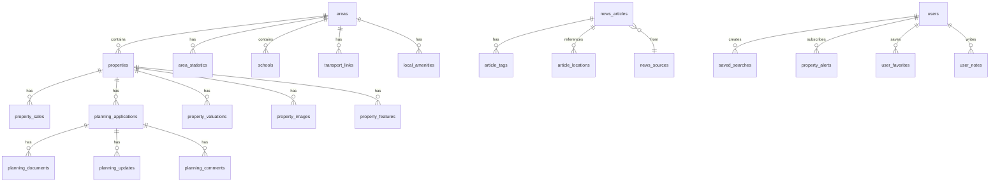

# Database Schema Documentation

## Overview

The NW London Local Ledger database is designed for high performance, scalability, and data integrity. It uses PostgreSQL 15 with PostGIS extensions for geographical data and TimescaleDB for time-series analytics.

## Entity Relationship Model



## Core Tables

### 1. Properties Table

```sql
CREATE TABLE properties (
    id BIGSERIAL PRIMARY KEY,
    uprn VARCHAR(20) UNIQUE, -- Unique Property Reference Number
    address_line_1 VARCHAR(255) NOT NULL,
    address_line_2 VARCHAR(255),
    town VARCHAR(100) NOT NULL,
    postcode VARCHAR(10) NOT NULL,
    full_address TEXT GENERATED ALWAYS AS (
        CONCAT_WS(', ', address_line_1, address_line_2, town, postcode)
    ) STORED,

    -- Geographical data
    latitude DECIMAL(10, 8) NOT NULL,
    longitude DECIMAL(11, 8) NOT NULL,
    location GEOGRAPHY(POINT, 4326), -- PostGIS point
    area_id INTEGER REFERENCES areas(id),
    ward VARCHAR(100),
    constituency VARCHAR(100),

    -- Property details
    property_type VARCHAR(50) CHECK (property_type IN (
        'detached', 'semi-detached', 'terraced', 'flat',
        'maisonette', 'bungalow', 'park-home', 'other'
    )),
    property_subtype VARCHAR(50),
    bedrooms INTEGER,
    bathrooms INTEGER,
    reception_rooms INTEGER,

    -- Building information
    year_built INTEGER,
    floor_area_sqm DECIMAL(10, 2),
    plot_size_sqm DECIMAL(10, 2),
    floors INTEGER,

    -- EPC information
    epc_rating CHAR(1) CHECK (epc_rating IN ('A','B','C','D','E','F','G')),
    epc_potential_rating CHAR(1),
    epc_certificate_date DATE,

    -- Ownership
    tenure VARCHAR(50) CHECK (tenure IN ('freehold', 'leasehold', 'shared-ownership')),
    lease_years_remaining INTEGER,

    -- Council tax
    council_tax_band CHAR(1) CHECK (council_tax_band IN ('A','B','C','D','E','F','G','H')),

    -- Metadata
    created_at TIMESTAMP WITH TIME ZONE DEFAULT CURRENT_TIMESTAMP,
    updated_at TIMESTAMP WITH TIME ZONE DEFAULT CURRENT_TIMESTAMP,
    data_source VARCHAR(50),
    last_verified DATE,

    -- Indexes for performance
    INDEX idx_properties_postcode (postcode),
    INDEX idx_properties_area (area_id),
    INDEX idx_properties_type (property_type),
    INDEX idx_properties_location USING GIST (location),
    INDEX idx_properties_full_text USING GIN (
        to_tsvector('english', full_address || ' ' || COALESCE(property_type, ''))
    )
);

-- Add spatial index
CREATE INDEX idx_properties_geography ON properties USING GIST (location);

-- Add trigger for updated_at
CREATE TRIGGER update_properties_updated_at
BEFORE UPDATE ON properties
FOR EACH ROW EXECUTE FUNCTION update_updated_at_column();
```

### 2. Property Sales Table

```sql
CREATE TABLE property_sales (
    id BIGSERIAL PRIMARY KEY,
    property_id BIGINT REFERENCES properties(id) ON DELETE CASCADE,

    -- Transaction details
    sale_price DECIMAL(12, 2) NOT NULL,
    sale_date DATE NOT NULL,
    transaction_type VARCHAR(50) CHECK (transaction_type IN (
        'standard', 'new-build', 'transfer', 'additional'
    )),

    -- Property details at time of sale
    property_type_at_sale VARCHAR(50),
    new_build BOOLEAN DEFAULT FALSE,

    -- Calculated fields
    price_per_sqm DECIMAL(10, 2) GENERATED ALWAYS AS (
        CASE
            WHEN floor_area_sqm > 0 THEN sale_price / floor_area_sqm
            ELSE NULL
        END
    ) STORED,

    -- Market context
    market_value_estimate DECIMAL(12, 2),
    above_below_market_pct DECIMAL(5, 2),

    -- Source information
    land_registry_reference VARCHAR(50) UNIQUE,
    data_source VARCHAR(50) DEFAULT 'land_registry',

    -- Metadata
    created_at TIMESTAMP WITH TIME ZONE DEFAULT CURRENT_TIMESTAMP,
    updated_at TIMESTAMP WITH TIME ZONE DEFAULT CURRENT_TIMESTAMP,

    -- Composite index for common queries
    INDEX idx_sales_property_date (property_id, sale_date DESC),
    INDEX idx_sales_date (sale_date DESC),
    INDEX idx_sales_price (sale_price),
    INDEX idx_sales_postcode_date (
        (SELECT postcode FROM properties WHERE id = property_id),
        sale_date DESC
    )
);

-- Partition by year for better performance
CREATE TABLE property_sales_2024 PARTITION OF property_sales
FOR VALUES FROM ('2024-01-01') TO ('2025-01-01');
```

### 3. Planning Applications Table

```sql
CREATE TABLE planning_applications (
    id BIGSERIAL PRIMARY KEY,
    reference VARCHAR(50) NOT NULL,
    property_id BIGINT REFERENCES properties(id),
    council VARCHAR(50) NOT NULL,

    -- Application details
    application_type VARCHAR(100),
    description TEXT NOT NULL,
    detailed_description TEXT,

    -- Status tracking
    status VARCHAR(50) CHECK (status IN (
        'pending', 'under-review', 'consultation',
        'approved', 'refused', 'withdrawn', 'appealed'
    )),
    decision VARCHAR(50),
    decision_date DATE,

    -- Important dates
    submitted_date DATE NOT NULL,
    validated_date DATE,
    consultation_end_date DATE,
    target_decision_date DATE,

    -- Applicant information
    applicant_name VARCHAR(255),
    agent_name VARCHAR(255),

    -- Planning details
    development_type VARCHAR(100),
    minor_material_amendment BOOLEAN DEFAULT FALSE,
    listed_building_consent BOOLEAN DEFAULT FALSE,
    conservation_area BOOLEAN DEFAULT FALSE,

    -- Impact assessment
    neighbor_consultations INTEGER DEFAULT 0,
    objections_count INTEGER DEFAULT 0,
    support_count INTEGER DEFAULT 0,

    -- Officer details
    case_officer VARCHAR(255),
    ward_councillors TEXT[],

    -- Documents
    documents_count INTEGER DEFAULT 0,

    -- Geographical
    site_location GEOGRAPHY(POINT, 4326),

    -- Metadata
    created_at TIMESTAMP WITH TIME ZONE DEFAULT CURRENT_TIMESTAMP,
    updated_at TIMESTAMP WITH TIME ZONE DEFAULT CURRENT_TIMESTAMP,
    last_scraped_at TIMESTAMP WITH TIME ZONE,
    scraping_status VARCHAR(50),

    -- Unique constraint
    UNIQUE(council, reference),

    -- Indexes
    INDEX idx_planning_property (property_id),
    INDEX idx_planning_status (status),
    INDEX idx_planning_dates (submitted_date DESC, decision_date DESC),
    INDEX idx_planning_council_ref (council, reference),
    INDEX idx_planning_location USING GIST (site_location)
);
```

### 4. News Articles Table

```sql
CREATE TABLE news_articles (
    id BIGSERIAL PRIMARY KEY,

    -- Content
    title VARCHAR(500) NOT NULL,
    slug VARCHAR(500) UNIQUE NOT NULL,
    summary TEXT,
    content TEXT NOT NULL,

    -- Categorization
    category VARCHAR(50) CHECK (category IN (
        'property', 'planning', 'transport', 'education',
        'crime', 'events', 'business', 'politics', 'other'
    )),
    subcategory VARCHAR(50),

    -- Source information
    source_id INTEGER REFERENCES news_sources(id),
    source_url TEXT,
    author VARCHAR(255),

    -- AI generation metadata
    ai_generated BOOLEAN DEFAULT FALSE,
    ai_model VARCHAR(50),
    ai_confidence_score DECIMAL(3, 2),
    human_reviewed BOOLEAN DEFAULT FALSE,

    -- Publishing
    published_date TIMESTAMP WITH TIME ZONE NOT NULL,
    updated_date TIMESTAMP WITH TIME ZONE,
    status VARCHAR(20) CHECK (status IN ('draft', 'published', 'archived')),

    -- Engagement metrics
    view_count INTEGER DEFAULT 0,
    share_count INTEGER DEFAULT 0,

    -- SEO
    meta_description TEXT,
    meta_keywords TEXT[],
    canonical_url TEXT,

    -- Media
    featured_image_url TEXT,
    images JSONB,

    -- Location relevance
    relevant_postcodes TEXT[],
    relevant_areas INTEGER[],

    -- Metadata
    created_at TIMESTAMP WITH TIME ZONE DEFAULT CURRENT_TIMESTAMP,
    updated_at TIMESTAMP WITH TIME ZONE DEFAULT CURRENT_TIMESTAMP,

    -- Full text search
    search_vector tsvector GENERATED ALWAYS AS (
        setweight(to_tsvector('english', coalesce(title, '')), 'A') ||
        setweight(to_tsvector('english', coalesce(summary, '')), 'B') ||
        setweight(to_tsvector('english', coalesce(content, '')), 'C')
    ) STORED,

    -- Indexes
    INDEX idx_articles_published (published_date DESC),
    INDEX idx_articles_category (category, published_date DESC),
    INDEX idx_articles_source (source_id),
    INDEX idx_articles_search USING GIN (search_vector),
    INDEX idx_articles_postcodes USING GIN (relevant_postcodes),
    INDEX idx_articles_areas USING GIN (relevant_areas)
);
```

### 5. Areas Table

```sql
CREATE TABLE areas (
    id SERIAL PRIMARY KEY,

    -- Area identification
    name VARCHAR(100) NOT NULL,
    code VARCHAR(20) UNIQUE NOT NULL, -- e.g., 'NW3', 'NW1-NW11'
    type VARCHAR(50) CHECK (type IN (
        'postcode', 'district', 'ward', 'neighborhood', 'borough'
    )),

    -- Hierarchy
    parent_area_id INTEGER REFERENCES areas(id),
    borough VARCHAR(100),

    -- Geographical
    boundary GEOGRAPHY(MULTIPOLYGON, 4326),
    center_point GEOGRAPHY(POINT, 4326),
    area_sqkm DECIMAL(10, 2),

    -- Demographics (cached/calculated)
    population INTEGER,
    households INTEGER,
    avg_household_size DECIMAL(3, 2),

    -- Property statistics (cached/calculated)
    total_properties INTEGER,
    avg_property_price DECIMAL(12, 2),
    avg_price_per_sqm DECIMAL(10, 2),
    price_change_1y_pct DECIMAL(5, 2),
    price_change_5y_pct DECIMAL(5, 2),

    -- Area characteristics
    crime_rate_per_1000 DECIMAL(6, 2),
    school_rating_avg DECIMAL(3, 2),
    transport_score INTEGER CHECK (transport_score BETWEEN 0 AND 100),
    walkability_score INTEGER CHECK (walkability_score BETWEEN 0 AND 100),

    -- Description
    description TEXT,
    key_features TEXT[],
    notable_residents TEXT[],

    -- SEO content
    meta_title VARCHAR(255),
    meta_description TEXT,
    content TEXT, -- Long-form area guide content

    -- Metadata
    created_at TIMESTAMP WITH TIME ZONE DEFAULT CURRENT_TIMESTAMP,
    updated_at TIMESTAMP WITH TIME ZONE DEFAULT CURRENT_TIMESTAMP,
    stats_updated_at TIMESTAMP WITH TIME ZONE,

    -- Indexes
    INDEX idx_areas_type (type),
    INDEX idx_areas_borough (borough),
    INDEX idx_areas_boundary USING GIST (boundary)
);
```

### 6. Schools Table

```sql
CREATE TABLE schools (
    id SERIAL PRIMARY KEY,

    -- School identification
    urn VARCHAR(20) UNIQUE, -- Unique Reference Number
    name VARCHAR(255) NOT NULL,
    type VARCHAR(50) CHECK (type IN (
        'primary', 'secondary', 'all-through', 'nursery',
        'sixth-form', 'special', 'pupil-referral-unit'
    )),

    -- Location
    address TEXT NOT NULL,
    postcode VARCHAR(10) NOT NULL,
    latitude DECIMAL(10, 8),
    longitude DECIMAL(11, 8),
    location GEOGRAPHY(POINT, 4326),
    area_id INTEGER REFERENCES areas(id),

    -- School details
    phase VARCHAR(50),
    gender VARCHAR(20) CHECK (gender IN ('mixed', 'boys', 'girls')),
    age_range_lower INTEGER,
    age_range_upper INTEGER,
    sixth_form BOOLEAN DEFAULT FALSE,

    -- Capacity
    capacity INTEGER,
    total_pupils INTEGER,

    -- Performance
    ofsted_rating VARCHAR(20) CHECK (ofsted_rating IN (
        'outstanding', 'good', 'requires-improvement', 'inadequate'
    )),
    ofsted_date DATE,
    progress_8_score DECIMAL(4, 2),
    attainment_8_score DECIMAL(4, 2),
    ebacc_average_score DECIMAL(4, 2),

    -- Admissions
    admissions_policy VARCHAR(50),
    catchment_area GEOGRAPHY(MULTIPOLYGON, 4326),
    oversubscribed BOOLEAN,

    -- Contact
    website TEXT,
    email VARCHAR(255),
    telephone VARCHAR(20),
    head_teacher VARCHAR(255),

    -- Metadata
    created_at TIMESTAMP WITH TIME ZONE DEFAULT CURRENT_TIMESTAMP,
    updated_at TIMESTAMP WITH TIME ZONE DEFAULT CURRENT_TIMESTAMP,
    last_inspection_date DATE,

    -- Indexes
    INDEX idx_schools_postcode (postcode),
    INDEX idx_schools_area (area_id),
    INDEX idx_schools_type (type),
    INDEX idx_schools_rating (ofsted_rating),
    INDEX idx_schools_location USING GIST (location),
    INDEX idx_schools_catchment USING GIST (catchment_area)
);
```

## Supporting Tables

### 7. Property Valuations Table

```sql
CREATE TABLE property_valuations (
    id BIGSERIAL PRIMARY KEY,
    property_id BIGINT REFERENCES properties(id) ON DELETE CASCADE,

    -- Valuation details
    valuation_date DATE NOT NULL,
    estimated_value DECIMAL(12, 2) NOT NULL,
    confidence_score DECIMAL(3, 2),

    -- Methodology
    valuation_method VARCHAR(50) CHECK (valuation_method IN (
        'comparables', 'hedonic', 'income', 'automated', 'professional'
    )),

    -- Comparables used
    comparables_count INTEGER,
    comparables_avg_price DECIMAL(12, 2),
    comparables_date_range_days INTEGER,

    -- Adjustments
    condition_adjustment DECIMAL(5, 2),
    location_adjustment DECIMAL(5, 2),
    size_adjustment DECIMAL(5, 2),

    -- Range estimates
    value_lower_bound DECIMAL(12, 2),
    value_upper_bound DECIMAL(12, 2),

    -- Metadata
    created_at TIMESTAMP WITH TIME ZONE DEFAULT CURRENT_TIMESTAMP,
    source VARCHAR(50),

    -- Indexes
    INDEX idx_valuations_property_date (property_id, valuation_date DESC)
);
```

### 8. Transport Links Table

```sql
CREATE TABLE transport_links (
    id SERIAL PRIMARY KEY,

    -- Station details
    name VARCHAR(255) NOT NULL,
    type VARCHAR(50) CHECK (type IN (
        'tube', 'overground', 'dlr', 'tram', 'national-rail', 'bus-stop'
    )),

    -- Location
    latitude DECIMAL(10, 8) NOT NULL,
    longitude DECIMAL(11, 8) NOT NULL,
    location GEOGRAPHY(POINT, 4326),
    area_id INTEGER REFERENCES areas(id),

    -- For tube/rail
    lines TEXT[],
    zones INTEGER[],
    step_free_access BOOLEAN,

    -- Services
    facilities TEXT[],
    parking_spaces INTEGER,
    bike_parking BOOLEAN,

    -- Usage stats
    annual_entries INTEGER,
    annual_exits INTEGER,

    -- Metadata
    created_at TIMESTAMP WITH TIME ZONE DEFAULT CURRENT_TIMESTAMP,
    updated_at TIMESTAMP WITH TIME ZONE DEFAULT CURRENT_TIMESTAMP,

    -- Indexes
    INDEX idx_transport_type (type),
    INDEX idx_transport_area (area_id),
    INDEX idx_transport_location USING GIST (location)
);
```

### 9. User Tables

```sql
-- Users table
CREATE TABLE users (
    id SERIAL PRIMARY KEY,
    email VARCHAR(255) UNIQUE NOT NULL,
    password_hash VARCHAR(255),

    -- Profile
    first_name VARCHAR(100),
    last_name VARCHAR(100),
    phone VARCHAR(20),

    -- Preferences
    preferred_areas INTEGER[],
    property_types_interest TEXT[],
    min_price DECIMAL(12, 2),
    max_price DECIMAL(12, 2),

    -- Account status
    email_verified BOOLEAN DEFAULT FALSE,
    active BOOLEAN DEFAULT TRUE,
    role VARCHAR(20) DEFAULT 'user',

    -- Tracking
    last_login_at TIMESTAMP WITH TIME ZONE,
    login_count INTEGER DEFAULT 0,

    -- Metadata
    created_at TIMESTAMP WITH TIME ZONE DEFAULT CURRENT_TIMESTAMP,
    updated_at TIMESTAMP WITH TIME ZONE DEFAULT CURRENT_TIMESTAMP,

    -- Indexes
    INDEX idx_users_email (email)
);

-- Saved searches
CREATE TABLE saved_searches (
    id SERIAL PRIMARY KEY,
    user_id INTEGER REFERENCES users(id) ON DELETE CASCADE,

    -- Search criteria
    name VARCHAR(255),
    search_criteria JSONB NOT NULL,

    -- Notification preferences
    email_alerts BOOLEAN DEFAULT TRUE,
    alert_frequency VARCHAR(20) CHECK (alert_frequency IN (
        'instant', 'daily', 'weekly'
    )),

    -- Tracking
    last_run_at TIMESTAMP WITH TIME ZONE,
    results_count INTEGER DEFAULT 0,

    -- Metadata
    created_at TIMESTAMP WITH TIME ZONE DEFAULT CURRENT_TIMESTAMP,
    updated_at TIMESTAMP WITH TIME ZONE DEFAULT CURRENT_TIMESTAMP,

    -- Indexes
    INDEX idx_saved_searches_user (user_id)
);
```

## Indexing Strategy for SEO Performance

### 1. Full-Text Search Indexes

```sql
-- Create custom text search configuration
CREATE TEXT SEARCH CONFIGURATION custom_english ( COPY = english );

-- Add custom dictionary for UK property terms
CREATE TEXT SEARCH DICTIONARY property_terms (
    TEMPLATE = simple,
    STOPWORDS = property_stopwords
);

ALTER TEXT SEARCH CONFIGURATION custom_english
    ALTER MAPPING FOR word WITH property_terms, english_stem;

-- Create materialized view for search
CREATE MATERIALIZED VIEW search_index AS
SELECT
    'property' as type,
    p.id,
    p.full_address as title,
    CONCAT(
        p.full_address, ' ',
        p.property_type, ' ',
        COALESCE(p.bedrooms || ' bed', ''), ' ',
        a.name, ' ',
        a.description
    ) as content,
    p.location,
    p.postcode,
    to_tsvector('custom_english',
        p.full_address || ' ' ||
        COALESCE(p.property_type, '') || ' ' ||
        COALESCE(a.name, '') || ' ' ||
        COALESCE(a.description, '')
    ) as search_vector
FROM properties p
LEFT JOIN areas a ON p.area_id = a.id

UNION ALL

SELECT
    'planning' as type,
    pa.id,
    pa.reference || ': ' || LEFT(pa.description, 100) as title,
    pa.description || ' ' || pa.detailed_description as content,
    p.location,
    p.postcode,
    to_tsvector('custom_english',
        pa.description || ' ' ||
        COALESCE(pa.detailed_description, '')
    ) as search_vector
FROM planning_applications pa
LEFT JOIN properties p ON pa.property_id = p.id

UNION ALL

SELECT
    'news' as type,
    n.id,
    n.title,
    n.content,
    NULL as location,
    array_to_string(n.relevant_postcodes, ' ') as postcode,
    n.search_vector
FROM news_articles n;

-- Create indexes on materialized view
CREATE INDEX idx_search_index_vector ON search_index USING GIN (search_vector);
CREATE INDEX idx_search_index_type ON search_index (type);
CREATE INDEX idx_search_index_postcode ON search_index (postcode);

-- Refresh strategy
CREATE OR REPLACE FUNCTION refresh_search_index()
RETURNS void AS $$
BEGIN
    REFRESH MATERIALIZED VIEW CONCURRENTLY search_index;
END;
$$ LANGUAGE plpgsql;

-- Schedule refresh every hour
SELECT cron.schedule('refresh-search-index', '0 * * * *', 'SELECT refresh_search_index()');
```

### 2. Geographical Indexes

```sql
-- Spatial indexes for location-based queries
CREATE INDEX idx_properties_location_gist ON properties USING GIST (location);
CREATE INDEX idx_planning_location_gist ON planning_applications USING GIST (site_location);
CREATE INDEX idx_areas_boundary_gist ON areas USING GIST (boundary);
CREATE INDEX idx_schools_catchment_gist ON schools USING GIST (catchment_area);

-- Function for finding nearby properties
CREATE OR REPLACE FUNCTION find_nearby_properties(
    lat DECIMAL,
    lon DECIMAL,
    radius_meters INTEGER DEFAULT 1000
)
RETURNS TABLE (
    property_id BIGINT,
    distance_meters DOUBLE PRECISION
) AS $$
BEGIN
    RETURN QUERY
    SELECT
        p.id,
        ST_Distance(
            p.location::geography,
            ST_MakePoint(lon, lat)::geography
        ) as distance_meters
    FROM properties p
    WHERE ST_DWithin(
        p.location::geography,
        ST_MakePoint(lon, lat)::geography,
        radius_meters
    )
    ORDER BY distance_meters;
END;
$$ LANGUAGE plpgsql;
```

### 3. Performance Optimization Indexes

```sql
-- Composite indexes for common query patterns
CREATE INDEX idx_properties_search
    ON properties (postcode, property_type, bedrooms, status);

CREATE INDEX idx_sales_analysis
    ON property_sales (sale_date DESC, sale_price)
    WHERE sale_date > CURRENT_DATE - INTERVAL '2 years';

CREATE INDEX idx_planning_active
    ON planning_applications (submitted_date DESC, status)
    WHERE status IN ('pending', 'under-review', 'consultation');

-- Partial indexes for specific queries
CREATE INDEX idx_properties_for_sale
    ON properties (price, bedrooms, property_type)
    WHERE status = 'for-sale';

CREATE INDEX idx_recent_news
    ON news_articles (published_date DESC, category)
    WHERE status = 'published'
    AND published_date > CURRENT_DATE - INTERVAL '30 days';

-- BRIN indexes for time-series data
CREATE INDEX idx_sales_date_brin
    ON property_sales USING BRIN (sale_date);
```

## Data Retention Policies

### 1. Retention Rules

```sql
-- Create partitioned tables for time-based retention
CREATE TABLE audit_logs (
    id BIGSERIAL,
    table_name VARCHAR(50),
    operation VARCHAR(10),
    user_id INTEGER,
    changed_data JSONB,
    created_at TIMESTAMP WITH TIME ZONE DEFAULT CURRENT_TIMESTAMP,
    PRIMARY KEY (id, created_at)
) PARTITION BY RANGE (created_at);

-- Create monthly partitions
CREATE TABLE audit_logs_2024_01 PARTITION OF audit_logs
    FOR VALUES FROM ('2024-01-01') TO ('2024-02-01');

-- Automated partition management
CREATE OR REPLACE FUNCTION create_monthly_partitions()
RETURNS void AS $$
DECLARE
    start_date DATE;
    end_date DATE;
    partition_name TEXT;
BEGIN
    start_date := DATE_TRUNC('month', CURRENT_DATE);
    end_date := start_date + INTERVAL '1 month';
    partition_name := 'audit_logs_' || TO_CHAR(start_date, 'YYYY_MM');

    EXECUTE format(
        'CREATE TABLE IF NOT EXISTS %I PARTITION OF audit_logs
         FOR VALUES FROM (%L) TO (%L)',
        partition_name, start_date, end_date
    );
END;
$$ LANGUAGE plpgsql;

-- Schedule partition creation
SELECT cron.schedule('create-partitions', '0 0 1 * *', 'SELECT create_monthly_partitions()');
```

### 2. Data Archival Strategy

```sql
-- Archive old data to cold storage
CREATE TABLE archived_property_sales (
    LIKE property_sales INCLUDING ALL
);

-- Move old sales to archive
CREATE OR REPLACE FUNCTION archive_old_sales()
RETURNS void AS $$
BEGIN
    -- Move sales older than 5 years to archive
    INSERT INTO archived_property_sales
    SELECT * FROM property_sales
    WHERE sale_date < CURRENT_DATE - INTERVAL '5 years';

    -- Delete from main table
    DELETE FROM property_sales
    WHERE sale_date < CURRENT_DATE - INTERVAL '5 years';

    -- Update statistics
    ANALYZE property_sales;
    ANALYZE archived_property_sales;
END;
$$ LANGUAGE plpgsql;
```

### 3. GDPR Compliance

```sql
-- User data anonymization
CREATE OR REPLACE FUNCTION anonymize_user(user_id INTEGER)
RETURNS void AS $$
BEGIN
    UPDATE users
    SET
        email = 'deleted_' || id || '@example.com',
        password_hash = NULL,
        first_name = 'Deleted',
        last_name = 'User',
        phone = NULL,
        active = FALSE
    WHERE id = user_id;

    -- Remove associated personal data
    DELETE FROM saved_searches WHERE user_id = user_id;
    DELETE FROM property_alerts WHERE user_id = user_id;
    DELETE FROM user_notes WHERE user_id = user_id;
END;
$$ LANGUAGE plpgsql;

-- Data retention policy enforcement
CREATE TABLE data_retention_policies (
    id SERIAL PRIMARY KEY,
    table_name VARCHAR(100) NOT NULL,
    retention_days INTEGER NOT NULL,
    delete_query TEXT NOT NULL,
    last_run TIMESTAMP WITH TIME ZONE,
    enabled BOOLEAN DEFAULT TRUE
);

INSERT INTO data_retention_policies (table_name, retention_days, delete_query) VALUES
('audit_logs', 90, 'DELETE FROM audit_logs WHERE created_at < CURRENT_DATE - INTERVAL ''90 days'''),
('user_sessions', 30, 'DELETE FROM user_sessions WHERE last_activity < CURRENT_DATE - INTERVAL ''30 days'''),
('search_logs', 180, 'DELETE FROM search_logs WHERE created_at < CURRENT_DATE - INTERVAL ''180 days''');
```

## Database Maintenance

### 1. Vacuum and Analyze Strategy

```sql
-- Automated vacuum configuration
ALTER SYSTEM SET autovacuum_vacuum_scale_factor = 0.1;
ALTER SYSTEM SET autovacuum_analyze_scale_factor = 0.05;
ALTER SYSTEM SET autovacuum_max_workers = 4;

-- Custom vacuum settings for high-update tables
ALTER TABLE properties SET (autovacuum_vacuum_scale_factor = 0.05);
ALTER TABLE property_sales SET (autovacuum_analyze_scale_factor = 0.02);
ALTER TABLE news_articles SET (autovacuum_vacuum_scale_factor = 0.05);
```

### 2. Statistics and Query Optimization

```sql
-- Create statistics for correlated columns
CREATE STATISTICS property_stats (dependencies)
ON postcode, property_type, bedrooms FROM properties;

CREATE STATISTICS sales_stats (dependencies, ndistinct)
ON property_id, sale_date, sale_price FROM property_sales;

-- Monitor slow queries
CREATE EXTENSION IF NOT EXISTS pg_stat_statements;

-- View slow queries
CREATE VIEW slow_queries AS
SELECT
    query,
    calls,
    mean_exec_time,
    total_exec_time,
    min_exec_time,
    max_exec_time
FROM pg_stat_statements
WHERE mean_exec_time > 100
ORDER BY mean_exec_time DESC;
```

## Performance Monitoring

```sql
-- Create monitoring schema
CREATE SCHEMA IF NOT EXISTS monitoring;

-- Table sizes and growth
CREATE VIEW monitoring.table_sizes AS
SELECT
    schemaname,
    tablename,
    pg_size_pretty(pg_total_relation_size(schemaname||'.'||tablename)) AS size,
    pg_total_relation_size(schemaname||'.'||tablename) AS size_bytes
FROM pg_tables
WHERE schemaname NOT IN ('pg_catalog', 'information_schema')
ORDER BY pg_total_relation_size(schemaname||'.'||tablename) DESC;

-- Index usage
CREATE VIEW monitoring.index_usage AS
SELECT
    schemaname,
    tablename,
    indexname,
    idx_scan,
    idx_tup_read,
    idx_tup_fetch,
    pg_size_pretty(pg_relation_size(indexrelid)) AS index_size
FROM pg_stat_user_indexes
ORDER BY idx_scan DESC;

-- Cache hit ratios
CREATE VIEW monitoring.cache_hit_ratio AS
SELECT
    sum(heap_blks_read) as heap_read,
    sum(heap_blks_hit)  as heap_hit,
    sum(heap_blks_hit) / NULLIF(sum(heap_blks_hit) + sum(heap_blks_read), 0) as cache_hit_ratio
FROM pg_statio_user_tables;
```