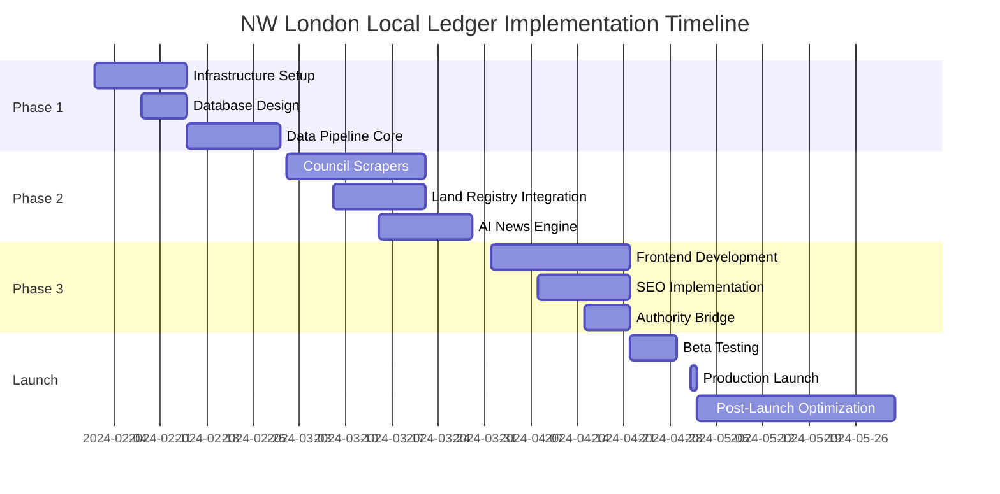

# Implementation Roadmap

## Project Timeline Overview



## Phase 1: Core Infrastructure & Data Pipeline (Months 1-2)

### Week 1-2: Project Setup & Infrastructure

#### Objectives
- Establish development environment
- Set up cloud infrastructure
- Configure CI/CD pipelines
- Create project structure

#### Deliverables

##### Day 1-3: Repository and Tools Setup
```bash
# Repository structure
nw-london-local-ledger/
├── apps/
│   ├── web/                 # Next.js frontend
│   ├── api/                 # Node.js API
│   └── scraper/             # Python scrapers
├── packages/
│   ├── database/            # Database schemas
│   ├── shared/              # Shared utilities
│   └── config/              # Configuration
├── infrastructure/
│   ├── terraform/           # Infrastructure as Code
│   ├── k8s/                # Kubernetes configs
│   └── docker/              # Docker configurations
└── scripts/                 # Automation scripts
```

##### Day 4-7: AWS Infrastructure Setup
```yaml
# Infrastructure components
resources:
  vpc:
    name: nw-ledger-vpc
    cidr: 10.0.0.0/16
    availability_zones: 3

  rds:
    engine: postgres
    version: "15"
    instance_class: db.t3.medium
    storage: 100GB

  elasticache:
    engine: redis
    node_type: cache.t3.micro
    num_nodes: 2

  ecs:
    cluster: nw-ledger-cluster
    services:
      - api-service
      - scraper-service

  s3:
    buckets:
      - nw-ledger-assets
      - nw-ledger-backups
```

##### Day 8-10: Development Environment
- Docker Compose setup for local development
- VS Code configuration and extensions
- Git hooks and commit conventions
- Environment variable management

##### Day 11-14: CI/CD Pipeline
```yaml
# GitHub Actions workflow
name: CI/CD Pipeline
on:
  push:
    branches: [main, develop]

jobs:
  test:
    runs-on: ubuntu-latest
    steps:
      - uses: actions/checkout@v3
      - name: Run tests
        run: |
          npm test
          npm run test:e2e

  build:
    needs: test
    steps:
      - name: Build Docker images
        run: |
          docker build -t api ./apps/api
          docker build -t scraper ./apps/scraper

  deploy:
    needs: build
    if: github.ref == 'refs/heads/main'
    steps:
      - name: Deploy to AWS
        run: |
          aws ecs update-service --service api-service
```

#### Success Metrics
- [ ] All team members have working development environments
- [ ] Infrastructure provisioned and accessible
- [ ] CI/CD pipeline successfully deploying to staging
- [ ] Monitoring and logging configured

### Week 3-4: Database Design & Implementation

#### Objectives
- Design and implement database schema
- Set up data migration tools
- Configure database replication
- Implement caching layer

#### Tasks

##### Database Schema Implementation
```sql
-- Priority tables to implement
-- Week 3: Core entities
CREATE TABLE properties (...);
CREATE TABLE areas (...);
CREATE TABLE property_sales (...);

-- Week 4: Supporting entities
CREATE TABLE planning_applications (...);
CREATE TABLE news_articles (...);
CREATE TABLE schools (...);
```

##### Data Migration Framework
```javascript
// Knex migration example
exports.up = function(knex) {
  return knex.schema
    .createTable('properties', table => {
      table.bigIncrements('id');
      table.string('uprn', 20).unique();
      table.string('address_line_1', 255).notNullable();
      table.string('postcode', 10).notNullable();
      table.decimal('latitude', 10, 8);
      table.decimal('longitude', 11, 8);
      table.timestamps(true, true);

      table.index('postcode');
      table.index(['latitude', 'longitude']);
    });
};
```

#### Deliverables
- [ ] Complete database schema implemented
- [ ] Seed data for development/testing
- [ ] Database backup and recovery procedures
- [ ] Performance benchmarks established

### Week 5-6: Data Pipeline Foundation

#### Objectives
- Build core data ingestion framework
- Implement job queue system
- Create data validation pipeline
- Set up monitoring and alerting

#### Implementation

##### Job Queue Architecture
```javascript
// Bull queue setup
const Queue = require('bull');
const Redis = require('ioredis');

const scraperQueue = new Queue('scraper', {
  redis: {
    host: process.env.REDIS_HOST,
    port: process.env.REDIS_PORT
  }
});

// Job processors
scraperQueue.process('council-planning', async (job) => {
  const { council, date } = job.data;
  const scraper = new CouncilScraper(council);
  return await scraper.scrape(date);
});

// Job scheduling
const schedule = require('node-cron');

schedule.schedule('0 2 * * *', () => {
  // Run daily at 2 AM
  councils.forEach(council => {
    scraperQueue.add('council-planning', { council, date: new Date() });
  });
});
```

##### Data Validation Pipeline
```python
# Data validation framework
from pydantic import BaseModel, validator
import pandas as pd

class PropertyRecord(BaseModel):
    address: str
    postcode: str
    price: Optional[float]

    @validator('postcode')
    def validate_postcode(cls, v):
        if not re.match(r'^NW\d{1,2}\s?\d[A-Z]{2}$', v):
            raise ValueError('Invalid NW London postcode')
        return v

    @validator('price')
    def validate_price(cls, v):
        if v and (v < 10000 or v > 50000000):
            raise ValueError('Price outside reasonable range')
        return v

class DataPipeline:
    def __init__(self):
        self.validators = {
            'property': PropertyRecord,
            'planning': PlanningRecord
        }

    async def process(self, data_type, records):
        validated = []
        errors = []

        for record in records:
            try:
                validated_record = self.validators[data_type](**record)
                validated.append(validated_record.dict())
            except ValidationError as e:
                errors.append({
                    'record': record,
                    'errors': e.errors()
                })

        # Store validated records
        await self.store(validated)

        # Log errors for review
        if errors:
            await self.log_errors(errors)

        return {
            'processed': len(validated),
            'errors': len(errors)
        }
```

### Week 7-8: Core API Development

#### Objectives
- Design RESTful API architecture
- Implement authentication/authorization
- Build core endpoints
- Create API documentation

#### API Specification

```yaml
# OpenAPI specification
openapi: 3.0.0
info:
  title: NW London Local Ledger API
  version: 1.0.0

paths:
  /properties:
    get:
      summary: Search properties
      parameters:
        - name: postcode
          in: query
          schema:
            type: string
        - name: min_price
          in: query
          schema:
            type: number
        - name: max_price
          in: query
          schema:
            type: number
      responses:
        200:
          description: List of properties
          content:
            application/json:
              schema:
                type: array
                items:
                  $ref: '#/components/schemas/Property'

  /properties/{id}:
    get:
      summary: Get property details
      parameters:
        - name: id
          in: path
          required: true
          schema:
            type: string
      responses:
        200:
          description: Property details
          content:
            application/json:
              schema:
                $ref: '#/components/schemas/PropertyDetail'

  /planning/applications:
    get:
      summary: Search planning applications
      parameters:
        - name: status
          in: query
          schema:
            type: string
            enum: [pending, approved, refused]
        - name: council
          in: query
          schema:
            type: string
      responses:
        200:
          description: List of planning applications
```

#### Implementation Milestones
- [ ] Authentication system with JWT
- [ ] Rate limiting and throttling
- [ ] Core CRUD operations for all entities
- [ ] Search and filtering capabilities
- [ ] API documentation with Swagger

## Phase 2: Page Generation & AI News Desk (Months 3-4)

### Week 9-10: Web Scraping Infrastructure

#### Objectives
- Implement council planning scrapers
- Build robust error handling
- Set up proxy rotation
- Create scraping monitoring dashboard

#### Council Scraper Implementation

```python
# Priority order for council scrapers
councils_implementation_order = [
    {
        'name': 'Camden',
        'week': 9,
        'complexity': 'medium',
        'portal_type': 'idox',
        'estimated_hours': 16
    },
    {
        'name': 'Westminster',
        'week': 9,
        'complexity': 'high',
        'portal_type': 'idox',
        'estimated_hours': 24
    },
    {
        'name': 'Barnet',
        'week': 10,
        'complexity': 'medium',
        'portal_type': 'idox',
        'estimated_hours': 16
    },
    {
        'name': 'Brent',
        'week': 10,
        'complexity': 'high',
        'portal_type': 'northgate',
        'estimated_hours': 24
    }
]
```

#### Scraper Testing Framework
```python
# Comprehensive testing for scrapers
class ScraperTestFramework:
    def __init__(self):
        self.test_cases = []

    def test_scraper_resilience(self, scraper):
        """Test scraper against various failure scenarios"""

        # Test network failures
        with mock_network_error():
            assert scraper.handle_network_error()

        # Test rate limiting
        with mock_rate_limit():
            assert scraper.handle_rate_limit()

        # Test data format changes
        with mock_html_change():
            assert scraper.handle_format_change()

        # Test proxy rotation
        assert scraper.rotate_proxy()

        return self.generate_report()
```

### Week 11-12: Frontend Development

#### Objectives
- Build responsive Next.js application
- Implement SEO-optimized pages
- Create interactive maps
- Design mobile-first UI

#### Frontend Architecture

```typescript
// Next.js app structure
app/
├── (public)/
│   ├── page.tsx                    // Homepage
│   ├── properties/
│   │   ├── page.tsx                // Property search
│   │   └── [id]/page.tsx          // Property detail
│   ├── planning/
│   │   ├── page.tsx                // Planning search
│   │   └── [reference]/page.tsx   // Application detail
│   ├── areas/
│   │   ├── page.tsx                // Area list
│   │   └── [postcode]/page.tsx    // Area guide
│   └── news/
│       ├── page.tsx                // News listing
│       └── [slug]/page.tsx        // Article page
├── api/
│   ├── properties/route.ts
│   ├── planning/route.ts
│   └── search/route.ts
└── components/
    ├── PropertyCard.tsx
    ├── PlanningMap.tsx
    ├── SearchFilters.tsx
    └── Newsletter.tsx
```

#### Component Development Priority
1. **Week 11**: Core layout and navigation
2. **Week 11**: Property search and listing pages
3. **Week 12**: Planning application pages
4. **Week 12**: Interactive map components

### Week 13-14: AI Content Generation

#### Objectives
- Integrate OpenAI GPT-4 API
- Build content generation pipeline
- Implement content moderation
- Create editorial workflow

#### AI Pipeline Implementation

```javascript
class AIContentEngine {
  constructor() {
    this.openai = new OpenAI({
      apiKey: process.env.OPENAI_API_KEY
    });
  }

  async generateArticle(topic, data) {
    // Generate article with GPT-4
    const prompt = this.buildPrompt(topic, data);

    const completion = await this.openai.chat.completions.create({
      model: "gpt-4-turbo",
      messages: [
        {
          role: "system",
          content: "You are a local journalist writing for NW London residents..."
        },
        {
          role: "user",
          content: prompt
        }
      ],
      temperature: 0.7,
      max_tokens: 1500
    });

    // Post-process and validate
    const article = completion.choices[0].message.content;
    return await this.postProcess(article);
  }

  async generateAreaGuide(postcode, data) {
    const template = {
      sections: [
        'Overview',
        'Property Market',
        'Schools',
        'Transport',
        'Local Amenities',
        'Recent Developments'
      ]
    };

    const guide = {};

    for (const section of template.sections) {
      guide[section] = await this.generateSection(section, postcode, data);
    }

    return this.formatGuide(guide);
  }
}
```

#### Content Generation Schedule
```yaml
content_schedule:
  daily:
    - type: news_summary
      time: "08:00"
      topics:
        - planning_approvals
        - property_sales
        - local_events

  weekly:
    - type: market_report
      day: monday
      time: "09:00"
      coverage:
        - price_trends
        - hotspot_areas
        - investment_opportunities

    - type: area_spotlight
      day: wednesday
      time: "10:00"
      rotation: sequential

  monthly:
    - type: comprehensive_report
      day: 1
      time: "00:00"
      includes:
        - market_analysis
        - planning_trends
        - school_updates
```

### Week 15-16: SEO Implementation

#### Objectives
- Implement programmatic SEO
- Generate thousands of optimized pages
- Set up schema markup
- Configure sitemaps and robots.txt

#### Programmatic Page Generation

```javascript
class SEOPageGenerator {
  async generatePages() {
    const pages = [];

    // Property pages (est. 5000)
    const properties = await this.getProperties();
    for (const property of properties) {
      pages.push({
        path: `/property/${property.id}`,
        title: `${property.address} - Property Details`,
        description: this.generatePropertyDescription(property),
        schema: this.generatePropertySchema(property)
      });
    }

    // Street pages (est. 2000)
    const streets = await this.getStreets();
    for (const street of streets) {
      pages.push({
        path: `/street/${street.slug}`,
        title: `${street.name} Property Prices and Information`,
        description: this.generateStreetDescription(street),
        schema: this.generateStreetSchema(street)
      });
    }

    // Area guides (est. 100)
    const areas = await this.getAreas();
    for (const area of areas) {
      pages.push({
        path: `/area/${area.code}`,
        title: `${area.name} Area Guide - Living in ${area.code}`,
        description: this.generateAreaDescription(area),
        content: await this.generateAreaContent(area),
        schema: this.generateAreaSchema(area)
      });
    }

    // Planning application pages (est. 3000)
    const applications = await this.getPlanningApplications();
    for (const app of applications) {
      pages.push({
        path: `/planning/${app.reference}`,
        title: `Planning Application ${app.reference} - ${app.address}`,
        description: this.generatePlanningDescription(app),
        schema: this.generatePlanningSchema(app)
      });
    }

    return pages;
  }

  generatePropertySchema(property) {
    return {
      "@context": "https://schema.org",
      "@type": "Residence",
      "name": property.address,
      "description": property.description,
      "address": {
        "@type": "PostalAddress",
        "streetAddress": property.address_line_1,
        "addressLocality": property.town,
        "postalCode": property.postcode,
        "addressCountry": "UK"
      },
      "geo": {
        "@type": "GeoCoordinates",
        "latitude": property.latitude,
        "longitude": property.longitude
      },
      "numberOfRooms": property.bedrooms,
      "floorSize": {
        "@type": "QuantitativeValue",
        "value": property.floor_area_sqm,
        "unitCode": "MTK"
      }
    };
  }
}
```

## Phase 3: Launch & Authority Bridge Integration (Month 5)

### Week 17-18: Beta Testing & Quality Assurance

#### Testing Strategy

```yaml
testing_phases:
  unit_testing:
    coverage_target: 80%
    tools:
      - Jest (JavaScript)
      - pytest (Python)

  integration_testing:
    scenarios:
      - Full data pipeline flow
      - API endpoint testing
      - Database operations
      - External service mocking

  e2e_testing:
    tools:
      - Playwright
      - Cypress
    test_cases:
      - User journey: Property search
      - User journey: Planning application tracking
      - User journey: Newsletter signup
      - Performance: Page load times
      - SEO: Meta tag validation

  load_testing:
    tool: k6
    scenarios:
      - baseline: 100 concurrent users
      - stress: 1000 concurrent users
      - spike: 0 to 500 users in 30s
    targets:
      - response_time_p95: < 500ms
      - error_rate: < 0.1%

  security_testing:
    checks:
      - OWASP Top 10
      - SQL injection
      - XSS vulnerabilities
      - API authentication
      - Rate limiting
```

#### Beta Launch Plan

```markdown
## Beta Testing Timeline

### Week 17: Internal Beta
- Team testing
- Bug fixing
- Performance optimization
- Content review

### Week 18: Closed Beta
- 50 selected users
- Feedback collection
- Analytics setup
- A/B testing framework

### Launch Criteria Checklist
- [ ] All critical bugs resolved
- [ ] Performance targets met
- [ ] SEO audit passed
- [ ] Security audit completed
- [ ] Content reviewed and approved
- [ ] Analytics tracking verified
- [ ] Backup and recovery tested
- [ ] Monitoring alerts configured
```

### Week 19: Authority Bridge Implementation

#### Integration Strategy

```javascript
// Authority Bridge implementation
class AuthorityBridge {
  constructor() {
    this.mainSite = 'https://hampsteadrenovations.co.uk';
    this.ledgerSite = 'https://nwlondonledger.com';
  }

  // Strategic internal linking
  generateContextualLinks(content, context) {
    const linkOpportunities = [
      {
        trigger: /planning permission/gi,
        link: `${this.mainSite}/planning-permission-guide`,
        anchor: 'planning permission expertise'
      },
      {
        trigger: /renovation/gi,
        link: `${this.mainSite}/services`,
        anchor: 'professional renovation services'
      },
      {
        trigger: /property value/gi,
        link: `${this.mainSite}/add-value-to-property`,
        anchor: 'maximize your property value'
      }
    ];

    let enhancedContent = content;

    linkOpportunities.forEach(opportunity => {
      if (opportunity.trigger.test(content)) {
        // Add contextual link only once per article
        enhancedContent = enhancedContent.replace(
          opportunity.trigger,
          `$& (see our guide on [${opportunity.anchor}](${opportunity.link}))`
        );
      }
    });

    return enhancedContent;
  }

  // Resource pages that bridge to main site
  createResourcePages() {
    return [
      {
        path: '/guides/planning-permission',
        title: 'Planning Permission Guide for NW London',
        content: this.generatePlanningGuide(),
        cta: {
          text: 'Need help with planning permission?',
          link: `${this.mainSite}/contact`
        }
      },
      {
        path: '/guides/property-renovation',
        title: 'Property Renovation Guide',
        content: this.generateRenovationGuide(),
        cta: {
          text: 'Get a renovation quote',
          link: `${this.mainSite}/quote`
        }
      },
      {
        path: '/calculators/renovation-roi',
        title: 'Renovation ROI Calculator',
        widget: this.createROICalculator(),
        cta: {
          text: 'Discuss your renovation project',
          link: `${this.mainSite}/consultation`
        }
      }
    ];
  }
}
```

### Week 20: Production Launch

#### Launch Day Checklist

```markdown
## Launch Day: May 1, 2024

### Pre-Launch (Day -1)
- [ ] Final database backup
- [ ] DNS configuration verified
- [ ] SSL certificates active
- [ ] CDN cache warmed
- [ ] Monitoring dashboard ready
- [ ] Support team briefed

### Launch Hour 0
- [ ] Switch DNS to production
- [ ] Enable production monitoring
- [ ] Verify all services running
- [ ] Test critical user paths
- [ ] Submit sitemaps to Google

### Launch Hour 1-4
- [ ] Monitor error rates
- [ ] Check page load times
- [ ] Verify data pipeline
- [ ] Review user registrations
- [ ] Address immediate issues

### Launch Day +1
- [ ] Team retrospective
- [ ] Performance review
- [ ] User feedback analysis
- [ ] Priority bug fixes
- [ ] Press release distribution
```

## Post-Launch Optimization (Month 6+)

### Week 21-24: Growth & Optimization

#### Growth Initiatives

```yaml
growth_roadmap:
  month_6:
    seo:
      - Submit to local directories
      - Build backlink partnerships
      - Optimize for featured snippets

    content:
      - Launch weekly newsletter
      - Start podcast/video content
      - User-generated content program

    features:
      - Mobile app development
      - API for developers
      - Premium subscriptions

  month_7:
    expansion:
      - Add South London coverage
      - Commercial property data
      - Rental market tracking

    partnerships:
      - Estate agent integrations
      - Mortgage broker partnerships
      - Local business directory

  month_8:
    innovation:
      - AI property valuation
      - Market prediction models
      - Virtual property tours
```

### Ongoing Maintenance Schedule

```yaml
maintenance_schedule:
  daily:
    - Data pipeline monitoring
    - Error log review
    - Performance metrics check
    - Content moderation

  weekly:
    - Database optimization
    - Security updates
    - A/B test reviews
    - Team sync meeting

  monthly:
    - Full backup and restore test
    - Security audit
    - Performance benchmarking
    - User feedback review

  quarterly:
    - Architecture review
    - Dependency updates
    - Disaster recovery drill
    - Strategic planning session
```

## Key Performance Indicators (KPIs)

### Technical KPIs

| Metric | Target | Measurement |
|--------|---------|-------------|
| Page Load Time | < 2s | Google PageSpeed |
| API Response Time | < 200ms | New Relic |
| Uptime | 99.9% | StatusPage |
| Error Rate | < 0.1% | Sentry |
| Data Freshness | < 24h | Custom Dashboard |

### Business KPIs

| Metric | Month 1 | Month 3 | Month 6 |
|--------|---------|---------|---------|
| Monthly Active Users | 1,000 | 10,000 | 50,000 |
| Page Views | 10,000 | 100,000 | 500,000 |
| Email Subscribers | 100 | 1,000 | 5,000 |
| Organic Traffic % | 20% | 50% | 70% |
| Conversion to Main Site | 1% | 2% | 3% |

### SEO KPIs

| Metric | Month 1 | Month 3 | Month 6 |
|--------|---------|---------|---------|
| Indexed Pages | 1,000 | 5,000 | 10,000 |
| Domain Authority | 10 | 20 | 35 |
| Ranking Keywords | 100 | 1,000 | 5,000 |
| Featured Snippets | 0 | 10 | 50 |
| Backlinks | 50 | 500 | 2,000 |

## Risk Management

### Identified Risks & Mitigation

```yaml
risks:
  technical:
    - risk: Scraping blocked by councils
      impact: high
      probability: medium
      mitigation:
        - Multiple scraping strategies
        - Proxy rotation
        - Manual fallback process
        - API partnerships

    - risk: Database performance issues
      impact: high
      probability: low
      mitigation:
        - Regular optimization
        - Read replicas
        - Caching strategy
        - Query monitoring

  business:
    - risk: Google algorithm changes
      impact: high
      probability: medium
      mitigation:
        - Focus on user value
        - Diverse traffic sources
        - Quality content
        - Technical SEO excellence

    - risk: Competition from established players
      impact: medium
      probability: high
      mitigation:
        - First mover advantage
        - Superior user experience
        - Unique data insights
        - Local focus

  legal:
    - risk: GDPR compliance issues
      impact: high
      probability: low
      mitigation:
        - Privacy by design
        - Regular audits
        - Clear policies
        - Data protection officer
```

## Resource Allocation

### Team Structure

```yaml
team:
  core_team:
    - role: Technical Lead
      responsibilities:
        - Architecture decisions
        - Code reviews
        - Technical mentorship
      allocation: 100%

    - role: Full Stack Developer (2)
      responsibilities:
        - Frontend development
        - API development
        - Testing
      allocation: 100%

    - role: Data Engineer
      responsibilities:
        - Data pipeline
        - Scraper development
        - Database optimization
      allocation: 100%

    - role: DevOps Engineer
      responsibilities:
        - Infrastructure
        - CI/CD
        - Monitoring
      allocation: 75%

    - role: Product Manager
      responsibilities:
        - Requirements gathering
        - Stakeholder management
        - Analytics
      allocation: 50%

  contractors:
    - role: UI/UX Designer
      duration: Month 1-3
      deliverables:
        - Design system
        - Page templates
        - Mobile designs

    - role: SEO Specialist
      duration: Month 4-6
      deliverables:
        - SEO audit
        - Content strategy
        - Link building

    - role: Content Writer
      duration: Month 3-6
      deliverables:
        - Area guides
        - Property descriptions
        - Blog content
```

### Budget Allocation

```yaml
budget_breakdown:
  infrastructure:
    aws: £500/month
    vercel: £200/month
    monitoring: £100/month
    total: £800/month

  services:
    openai_api: £300/month
    proxy_service: £200/month
    email_service: £50/month
    total: £550/month

  tools:
    development: £200/month
    analytics: £100/month
    total: £300/month

  marketing:
    content_creation: £1000/month
    paid_advertising: £500/month
    total: £1500/month

  contingency: £500/month

  monthly_total: £3,650
  5_month_total: £18,250
```

## Success Criteria

### Definition of Success

```markdown
## Project Success Metrics

### Technical Success
✓ System handles 10,000+ concurrent users
✓ 99.9% uptime achieved
✓ Sub-2 second page load times
✓ Zero critical security vulnerabilities

### Business Success
✓ 50,000+ monthly active users
✓ Top 3 Google rankings for 500+ local keywords
✓ 200+ qualified leads per month to main business
✓ Recognized as authoritative local resource

### Strategic Success
✓ Established domain authority (DA 35+)
✓ Sustainable organic traffic growth
✓ Positive ROI within 12 months
✓ Expansion potential validated
```

## Next Steps After Launch

1. **Month 6**: Mobile app development
2. **Month 7**: API marketplace launch
3. **Month 8**: Premium features rollout
4. **Month 9**: Geographic expansion
5. **Month 12**: Series A funding preparation