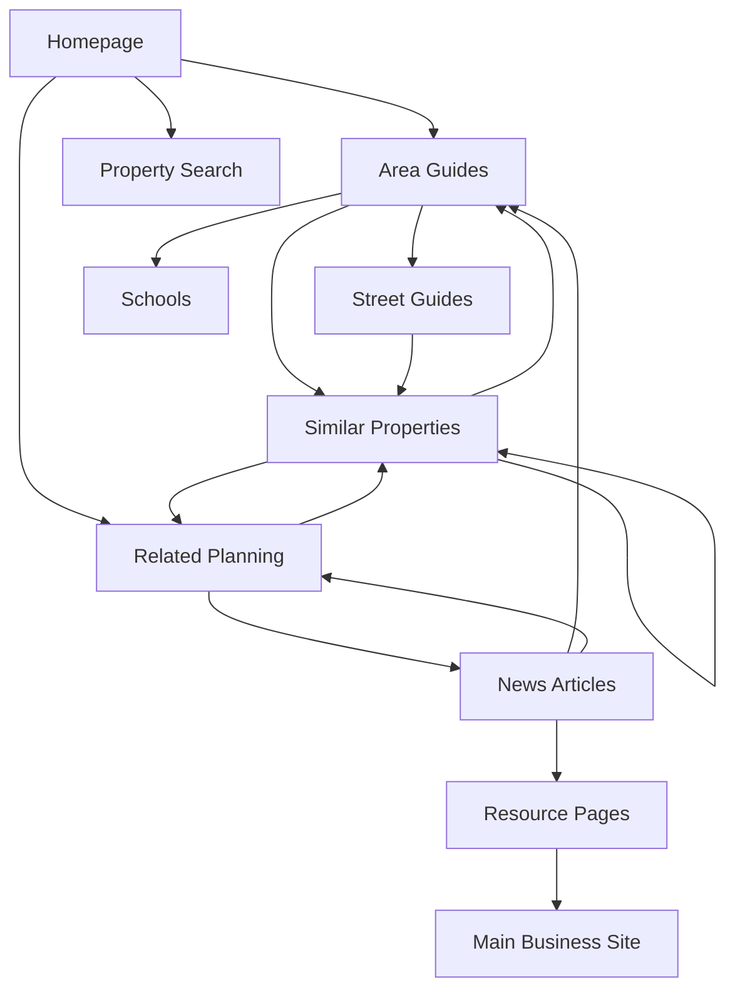

# SEO Strategy Document

## Executive Summary

The SEO strategy for NW London Local Ledger focuses on establishing dominant local search presence through programmatic content generation, strategic internal linking, and building topical authority for North West London property and planning queries. Our goal is to capture 70% of local property-related searches within 12 months.

## Strategic SEO Objectives

### Primary Goals
1. **Domain Authority**: Achieve DA 40+ within 18 months
2. **Organic Traffic**: 100,000+ monthly organic visitors by month 12
3. **Keyword Rankings**: Top 3 positions for 500+ local keywords
4. **Featured Snippets**: Capture 50+ featured snippets for high-value queries
5. **Local Pack Presence**: Appear in local pack for all NW postcode searches

### Target Audience Segments

```yaml
audience_segments:
  primary:
    - segment: Property Buyers
      intent: Research, valuation, market trends
      keywords: "NW3 house prices", "property for sale Camden"

    - segment: Homeowners
      intent: Planning applications, renovations, valuations
      keywords: "planning permission NW6", "house extension Hampstead"

    - segment: Local Residents
      intent: News, developments, community info
      keywords: "new developments Kilburn", "NW London news"

  secondary:
    - segment: Property Investors
      intent: Market analysis, opportunities
      keywords: "NW London investment property", "rental yields NW2"

    - segment: Estate Agents
      intent: Market data, comparables
      keywords: "NW5 property market report", "sold prices Belsize Park"
```

## Keyword Research and Targeting

### Keyword Categories

#### 1. Transactional Keywords (High Intent)
```csv
Keyword, Monthly Volume, Difficulty, Priority
"houses for sale NW3", 2400, Medium, High
"property prices NW6", 1900, Low, High
"planning permission Camden", 1600, Medium, High
"Hampstead property market", 880, Medium, High
"sold house prices NW1", 720, Low, High
```

#### 2. Informational Keywords (Content Opportunities)
```csv
Keyword, Monthly Volume, Difficulty, Priority
"living in Hampstead", 3200, Low, High
"best schools NW London", 2100, Low, High
"NW3 area guide", 590, Low, High
"Camden planning portal", 480, Low, Medium
"Kilburn regeneration", 320, Low, Medium
```

#### 3. Long-tail Property Addresses
```csv
Pattern, Example, Est. Volume, Strategy
"[number] [street] [area]", "23 Heath Street Hampstead", 10-50, Programmatic pages
"[street] property prices", "Finchley Road property prices", 100-300, Street guides
"[postcode] market report", "NW3 market report", 50-150, Area analytics
```

### Keyword Mapping Strategy

```javascript
const keywordStrategy = {
  homepage: {
    primary: "NW London property",
    secondary: ["North West London homes", "NW postcodes property data"],
    lsi: ["Camden", "Barnet", "Brent", "property prices", "planning applications"]
  },

  propertyPages: {
    template: "{address} - Property Details & History",
    keywords: [
      "{address}",
      "{street} {postcode}",
      "sold price {address}",
      "property history {address}"
    ]
  },

  areaGuides: {
    template: "Living in {area} - Complete {postcode} Area Guide",
    keywords: [
      "living in {area}",
      "{area} area guide",
      "{postcode} property prices",
      "best streets in {area}",
      "{area} schools",
      "{area} transport links"
    ]
  },

  planningPages: {
    template: "Planning Application {reference} - {address}",
    keywords: [
      "planning application {reference}",
      "{address} planning permission",
      "{council} planning {reference}"
    ]
  }
};
```

## On-Page SEO Optimization

### Page Template Optimization

#### 1. Title Tag Strategy
```html
<!-- Homepage -->
<title>NW London Property Data & Planning Applications | Local Ledger</title>

<!-- Property Page -->
<title>23 Heath Street, NW3 - £2.3M Property | Price History & Details</title>

<!-- Area Guide -->
<title>Hampstead Area Guide NW3 | Property Prices, Schools & Transport</title>

<!-- Planning Page -->
<title>Planning Application 2024/1234/P | 45 Finchley Road Extension</title>
```

#### 2. Meta Description Templates
```html
<!-- Property Page -->
<meta name="description" content="View detailed information for 23 Heath Street, NW3.
Last sold for £2.3M in 2023. See full price history, nearby properties, and planning applications.">

<!-- Area Guide -->
<meta name="description" content="Complete guide to living in Hampstead NW3.
Current property prices from £650K, outstanding schools, excellent transport links.
Updated November 2024.">
```

#### 3. Header Tag Hierarchy
```html
<h1>Primary Keyword - Unique Page Title</h1>
  <h2>Key Section with Secondary Keyword</h2>
    <h3>Supporting Detail with LSI Terms</h3>
    <h3>Additional Supporting Information</h3>
  <h2>Another Major Section</h2>
    <h3>Subsection Content</h3>
```

### Content Optimization Guidelines

```markdown
## Content Requirements per Page Type

### Property Pages (Min 800 words)
- Property overview (150 words)
- Price history table
- Local area information (200 words)
- Nearby amenities (150 words)
- Transport links (100 words)
- School catchment information (100 words)
- Similar properties (100 words)

### Area Guides (Min 2000 words)
- Introduction and overview (300 words)
- Property market analysis (400 words)
- Schools and education (400 words)
- Transport and connectivity (300 words)
- Local amenities and lifestyle (300 words)
- Demographics and statistics (200 words)
- Future developments (100 words)

### News Articles (Min 600 words)
- Lead paragraph with key facts (100 words)
- Main story content (400 words)
- Local context and impact (100 words)
- Related articles links
```

## Programmatic SEO Implementation

### Page Generation Strategy

```javascript
class ProgrammaticSEO {
  constructor() {
    this.pageTemplates = {
      property: this.generatePropertyPage,
      street: this.generateStreetPage,
      area: this.generateAreaPage,
      school: this.generateSchoolPage,
      planning: this.generatePlanningPage
    };
  }

  async generateAllPages() {
    const pages = [];

    // Generate 10,000+ unique pages
    pages.push(...await this.generatePropertyPages());      // ~5,000 pages
    pages.push(...await this.generateStreetPages());        // ~2,000 pages
    pages.push(...await this.generateAreaPages());          // ~100 pages
    pages.push(...await this.generateSchoolPages());        // ~500 pages
    pages.push(...await this.generatePlanningPages());      // ~2,500 pages

    return pages;
  }

  async generatePropertyPage(property) {
    return {
      url: `/property/${property.id}-${this.slugify(property.address)}`,
      title: `${property.address} - Property Details, Price History & Local Info`,
      content: {
        intro: await this.generatePropertyIntro(property),
        priceHistory: await this.getPriceHistory(property),
        localArea: await this.generateLocalAreaContent(property),
        similarProperties: await this.findSimilarProperties(property),
        schema: this.generatePropertySchema(property)
      },
      internalLinks: [
        `/area/${property.postcode}`,
        `/street/${this.slugify(property.street)}`,
        ...property.nearbyProperties.map(p => `/property/${p.id}`)
      ]
    };
  }

  generatePropertySchema(property) {
    return {
      "@context": "https://schema.org",
      "@type": "House",
      "name": property.address,
      "description": `${property.bedrooms} bedroom ${property.propertyType} in ${property.area}`,
      "address": {
        "@type": "PostalAddress",
        "streetAddress": property.streetAddress,
        "addressLocality": property.locality,
        "postalCode": property.postcode,
        "addressCountry": "GB"
      },
      "geo": {
        "@type": "GeoCoordinates",
        "latitude": property.latitude,
        "longitude": property.longitude
      },
      "numberOfRooms": property.bedrooms,
      "floorSize": {
        "@type": "QuantitativeValue",
        "value": property.floorArea,
        "unitCode": "MTK"
      }
    };
  }
}
```

### Dynamic Content Generation

```python
# AI-powered content variation for uniqueness
class ContentVariation:
    def __init__(self):
        self.templates = {
            'property_intro': [
                "This {bedrooms}-bedroom {property_type} on {street} represents {market_position} value in the {area} property market.",
                "Located on {street}, this {property_type} offers {bedrooms} bedrooms in one of {area}'s most {area_characteristic} neighborhoods.",
                "A {property_condition} {bedrooms}-bedroom {property_type} situated on {street}, in the heart of {area}."
            ],
            'area_description': [
                "{area} is renowned for its {characteristic1} and {characteristic2}, making it a {desirability} location for {buyer_type}.",
                "The {area} area combines {characteristic1} with {characteristic2}, attracting {buyer_type} seeking {lifestyle_aspect}.",
                "Known for {characteristic1}, {area} offers residents {benefit1} alongside {benefit2}."
            ]
        }

    def generate_unique_content(self, template_type, data):
        template = random.choice(self.templates[template_type])
        return template.format(**data)

    def ensure_uniqueness(self, content, existing_content):
        similarity = self.calculate_similarity(content, existing_content)
        if similarity > 0.7:
            return self.rewrite_content(content)
        return content
```

## Internal Linking Architecture

### Linking Strategy



### Internal Linking Rules

```javascript
const internalLinkingRules = {
  maxLinksPerPage: 100,

  linkingHierarchy: {
    homepage: {
      outbound: ['area-guides', 'top-properties', 'recent-news'],
      maxLinks: 20
    },
    areaGuide: {
      outbound: ['properties-in-area', 'schools', 'transport', 'child-areas'],
      maxLinks: 50
    },
    propertyPage: {
      outbound: ['area-guide', 'street-guide', 'similar-properties', 'planning-apps'],
      maxLinks: 30
    }
  },

  anchorTextRules: {
    exactMatch: 0.2,    // 20% exact match anchors
    partial: 0.3,       // 30% partial match
    branded: 0.1,       // 10% branded
    generic: 0.2,       // 20% generic (click here, learn more)
    natural: 0.2        // 20% natural variation
  },

  contextualLinking: {
    propertyMentions: /\b(\d+\s+[A-Z][a-z]+\s+(Street|Road|Lane|Avenue))\b/gi,
    areaMentions: /\b(Hampstead|Kilburn|Camden|Swiss Cottage|Belsize Park)\b/gi,
    postcodes: /\bNW([1-9]|1[01])\b/gi
  }
};
```

## Schema Markup Implementation

### Structured Data Types

```javascript
// Organization Schema (Homepage)
const organizationSchema = {
  "@context": "https://schema.org",
  "@type": "Organization",
  "name": "NW London Local Ledger",
  "url": "https://nwlondonledger.com",
  "logo": "https://nwlondonledger.com/logo.png",
  "description": "Comprehensive property and planning data for North West London",
  "areaServed": {
    "@type": "Place",
    "name": "North West London",
    "geo": {
      "@type": "GeoCircle",
      "geoMidpoint": {
        "@type": "GeoCoordinates",
        "latitude": 51.5517,
        "longitude": -0.1865
      },
      "geoRadius": "5000"
    }
  },
  "sameAs": [
    "https://twitter.com/nwlondonledger",
    "https://facebook.com/nwlondonledger"
  ]
};

// Local Business Schema (Area Pages)
const localBusinessSchema = {
  "@context": "https://schema.org",
  "@type": "RealEstateAgent",
  "name": "NW London Property Data",
  "image": "https://nwlondonledger.com/images/office.jpg",
  "address": {
    "@type": "PostalAddress",
    "addressLocality": "Hampstead",
    "addressRegion": "London",
    "postalCode": "NW3"
  },
  "geo": {
    "@type": "GeoCoordinates",
    "latitude": 51.5557,
    "longitude": -0.1785
  },
  "url": "https://nwlondonledger.com/areas/nw3",
  "telephone": "+44-20-1234-5678",
  "openingHoursSpecification": {
    "@type": "OpeningHoursSpecification",
    "dayOfWeek": ["Monday", "Tuesday", "Wednesday", "Thursday", "Friday"],
    "opens": "09:00",
    "closes": "18:00"
  }
};

// FAQ Schema (Resource Pages)
const faqSchema = {
  "@context": "https://schema.org",
  "@type": "FAQPage",
  "mainEntity": [
    {
      "@type": "Question",
      "name": "How much does planning permission cost in Camden?",
      "acceptedAnswer": {
        "@type": "Answer",
        "text": "Planning permission fees in Camden range from £206 for householder applications to £462 for full applications. Additional costs may include architect fees (£2,000-£5,000) and planning consultants (£1,500-£3,000)."
      }
    }
  ]
};

// Article Schema (News/Blog Posts)
const articleSchema = {
  "@context": "https://schema.org",
  "@type": "NewsArticle",
  "headline": "New Development Approved for Kilburn High Road",
  "image": ["https://nwlondonledger.com/images/kilburn-development.jpg"],
  "datePublished": "2024-11-15T08:00:00+00:00",
  "dateModified": "2024-11-15T09:00:00+00:00",
  "author": {
    "@type": "Organization",
    "name": "NW London Local Ledger"
  },
  "publisher": {
    "@type": "Organization",
    "name": "NW London Local Ledger",
    "logo": {
      "@type": "ImageObject",
      "url": "https://nwlondonledger.com/logo.png"
    }
  },
  "description": "Camden Council approves 150-unit residential development on Kilburn High Road",
  "articleBody": "Full article content here..."
};
```

## Content Strategy

### Content Calendar

```yaml
content_calendar:
  daily:
    - type: automated_news
      topics:
        - New planning applications
        - Property sales updates
        - Price changes
      volume: 5-10 articles

  weekly:
    monday:
      - type: market_report
        title: "NW London Property Market Weekly Report"
        keywords: ["weekly property report", "NW London market update"]

    wednesday:
      - type: area_spotlight
        title: "Area Spotlight: Living in {area}"
        rotation: [Hampstead, Kilburn, Camden, Swiss Cottage, Belsize Park]

    friday:
      - type: planning_roundup
        title: "Planning Applications This Week in {council}"
        councils: [Camden, Barnet, Brent, Westminster]

  monthly:
    - type: comprehensive_guide
      topics:
        - "Complete NW{n} Postcode Guide"
        - "School Catchment Areas Update"
        - "Transport Developments in NW London"
        - "Property Investment Opportunities"

  seasonal:
    spring:
      - "Spring Property Market Outlook"
      - "Garden Planning Applications Guide"

    summer:
      - "Best Outdoor Spaces in NW London"
      - "School Catchment Property Guide"

    autumn:
      - "Autumn Market Analysis"
      - "Winter Preparation Planning Applications"

    winter:
      - "Year in Review: NW London Property"
      - "Next Year's Market Predictions"
```

### Content Quality Guidelines

```markdown
## Content Standards

### Readability
- Flesch Reading Ease: 60-70
- Average sentence length: 15-20 words
- Paragraph length: 2-4 sentences
- Use of subheadings every 200-300 words

### E-E-A-T Signals
- **Experience**: Include real property examples and case studies
- **Expertise**: Cite official sources (Land Registry, Council data)
- **Authoritativeness**: Link to government sources
- **Trustworthiness**: Display data sources and update dates

### Content Freshness
- Update property prices: Weekly
- Update planning status: Daily
- Refresh area guides: Monthly
- Review evergreen content: Quarterly
```

## Authority Bridge Strategy

### Linking to Main Business

```javascript
const authorityBridgeStrategy = {
  contextualOpportunities: [
    {
      trigger: "planning permission",
      content: "For complex planning applications, professional guidance can be invaluable",
      link: "https://hampsteadrenovations.co.uk/planning-services",
      frequency: "once per article"
    },
    {
      trigger: "property renovation",
      content: "See typical renovation costs and ROI in NW London",
      link: "https://hampsteadrenovations.co.uk/renovation-costs",
      frequency: "once per article"
    },
    {
      trigger: "house extension",
      content: "Explore extension options for your property type",
      link: "https://hampsteadrenovations.co.uk/house-extensions",
      frequency: "once per article"
    }
  ],

  resourcePages: [
    {
      url: "/guides/renovation-roi-calculator",
      title: "Renovation ROI Calculator for NW London Properties",
      cta: "Get a detailed renovation quote",
      link: "https://hampsteadrenovations.co.uk/quote"
    },
    {
      url: "/guides/planning-permission-process",
      title: "Complete Guide to Planning Permission in NW London",
      cta: "Need help with planning permission?",
      link: "https://hampsteadrenovations.co.uk/planning-consultation"
    }
  ],

  footerLinks: [
    "Professional Renovation Services",
    "Planning Permission Assistance",
    "Free Property Consultation"
  ]
};
```

## Link Building Strategy

### Link Acquisition Tactics

```yaml
link_building_tactics:
  tier_1_opportunities:
    - tactic: Local Media Outreach
      targets:
        - Ham & High
        - Camden New Journal
        - Kilburn Times
      approach: Provide exclusive local property data stories

    - tactic: Council Partnerships
      targets:
        - Camden Council
        - Barnet Council
        - Brent Council
      approach: Offer free data widgets for council websites

    - tactic: School Partnerships
      targets:
        - Local primary schools
        - Secondary schools
      approach: Provide catchment area maps and property guides

  tier_2_opportunities:
    - tactic: Local Business Directory
      targets:
        - Estate agents
        - Mortgage brokers
        - Solicitors
      approach: Mutual linking partnerships

    - tactic: Community Organizations
      targets:
        - Residents associations
        - Community centers
        - Local charities
      approach: Sponsor local events, provide data

  tier_3_opportunities:
    - tactic: HARO (Help a Reporter Out)
      topics:
        - UK property market
        - London housing
        - Planning permission
      frequency: Daily monitoring

    - tactic: Guest Posting
      targets:
        - Property blogs
        - London lifestyle sites
        - Architecture publications
      topics:
        - NW London market analysis
        - Planning trends
        - Area guides
```

### Digital PR Strategy

```markdown
## Digital PR Campaigns

### Campaign 1: NW London Property Price Map
- Interactive map showing price changes
- Embeddable widget for media sites
- Press release to 100+ journalists
- Target: 50+ media pickups

### Campaign 2: School Catchment Property Premium
- Analysis of property premiums near good schools
- Infographic and data visualization
- Outreach to education and property media
- Target: 30+ backlinks

### Campaign 3: Planning Application Trends Report
- Quarterly report on planning trends
- Council-by-council breakdown
- Local media exclusive access
- Target: 20+ local media links

### Campaign 4: Celebrity Property Tracker
- Track celebrity properties in NW London
- Monthly updates and alerts
- Entertainment media outreach
- Target: National media coverage
```

## Local SEO Optimization

### Google Business Profile Optimization

```yaml
gbp_optimization:
  profile_completion:
    - Business name: NW London Local Ledger
    - Category: Property Information Service
    - Description: 750 characters with keywords
    - Service areas: All NW postcodes
    - Attributes: Online appointments, Free consultation

  content_strategy:
    posts:
      - frequency: 3x per week
      - types: [updates, offers, events, news]

    photos:
      - frequency: Weekly
      - types: [area photos, property highlights, infographics]

    qa:
      - Monitor and respond within 24 hours
      - Seed important questions
      - Include keywords in answers

  review_strategy:
    - Target: 10+ reviews per month
    - Response time: Within 48 hours
    - Response template with keywords
```

### Local Citations

```csv
Citation Source, Priority, Status, NAP Consistency
Google Business Profile, High, Active, Verified
Bing Places, High, Pending, Verified
Apple Maps, High, Pending, Verified
Yelp, Medium, Active, Verified
Yell.com, Medium, Pending, Verified
Thomson Local, Medium, Pending, Verified
FreeIndex, Low, Pending, Verified
Hotfrog, Low, Pending, Verified
```

## Technical SEO

### Site Architecture

```yaml
site_architecture:
  crawl_depth:
    max_clicks_from_homepage: 3
    orphan_pages: 0

  url_structure:
    properties: /property/{id}-{address-slug}
    areas: /area/{postcode-slug}
    planning: /planning/{council}/{reference}
    news: /news/{yyyy}/{mm}/{slug}

  pagination:
    strategy: rel=prev/next
    items_per_page: 20
    url_format: /page/{number}

  canonicalization:
    self_referencing: true
    parameter_handling: canonical to clean URL
    cross_domain: none
```

### Core Web Vitals Optimization

```javascript
// Performance optimization targets
const performanceTargets = {
  LCP: { // Largest Contentful Paint
    target: '< 2.5s',
    optimization: [
      'Preload critical resources',
      'Optimize images with next/image',
      'Use CDN for assets',
      'Implement resource hints'
    ]
  },
  FID: { // First Input Delay
    target: '< 100ms',
    optimization: [
      'Minimize JavaScript execution',
      'Break up long tasks',
      'Use web workers for heavy processing',
      'Implement code splitting'
    ]
  },
  CLS: { // Cumulative Layout Shift
    target: '< 0.1',
    optimization: [
      'Set size attributes for media',
      'Reserve space for ad slots',
      'Avoid inserting content above existing content',
      'Use CSS transform for animations'
    ]
  }
};
```

## Monitoring and Reporting

### KPI Dashboard

```yaml
seo_kpis:
  weekly_monitoring:
    - Organic traffic growth
    - New vs returning users
    - Bounce rate by landing page
    - Page load speed
    - Crawl errors

  monthly_reporting:
    - Keyword ranking changes
    - Featured snippets gained/lost
    - Backlink acquisition
    - Domain authority progress
    - Conversion rate to main site

  quarterly_review:
    - Content performance analysis
    - Competitor gap analysis
    - Technical SEO audit
    - Link profile assessment
    - ROI calculation

tracking_setup:
  google_analytics_4:
    - Conversion tracking
    - Event tracking
    - User flow analysis
    - Custom dimensions

  google_search_console:
    - Performance monitoring
    - Coverage issues
    - Core Web Vitals
    - Mobile usability

  third_party_tools:
    - Ahrefs: Backlink monitoring
    - SEMrush: Keyword tracking
    - Screaming Frog: Technical audits
    - ContentKing: Real-time monitoring
```

### Reporting Template

```markdown
## Monthly SEO Report Template

### Executive Summary
- Overall organic traffic: +X% MoM
- New keywords ranking: X
- Featured snippets gained: X
- Domain authority: XX (±X)

### Traffic Analysis
- Organic sessions: X (±X%)
- New users: X (±X%)
- Pages per session: X.X
- Average session duration: X:XX

### Keyword Performance
- Total ranking keywords: X
- Top 3 positions: X
- Top 10 positions: X
- New keywords gained: X

### Content Performance
- Top performing pages
- New content published
- Content updates made
- Engagement metrics

### Technical Health
- Page speed scores
- Crawl errors fixed
- Schema implementation
- Mobile usability issues

### Link Building
- New referring domains: X
- Total backlinks gained: X
- Lost backlinks: X
- Link quality score

### Competitor Analysis
- Ranking gaps identified
- Content opportunities
- Link gaps

### Next Month Priorities
1. Priority 1
2. Priority 2
3. Priority 3
```

## Risk Mitigation

### Algorithm Update Protection

```yaml
algorithm_protection:
  diversification:
    - Traffic sources: Not >50% from any single source
    - Keyword distribution: No single keyword >5% of traffic
    - Content types: Mix of informational, transactional, navigational

  quality_signals:
    - User engagement: Monitor dwell time, bounce rate
    - Content freshness: Regular updates to all content
    - Technical health: Weekly technical audits
    - Natural link profile: Diverse anchor text and sources

  monitoring:
    - Daily rank tracking for key terms
    - Traffic anomaly detection
    - Algorithm update calendar
    - Recovery plan ready
```

## Long-term SEO Roadmap

### Year 1: Foundation and Growth
- **Months 1-3**: Technical foundation, initial content
- **Months 4-6**: Link building, content scaling
- **Months 7-9**: Authority building, feature targeting
- **Months 10-12**: Optimization, expansion prep

### Year 2: Authority and Expansion
- **Q1**: Geographic expansion (South London)
- **Q2**: Commercial property vertical
- **Q3**: Rental market integration
- **Q4**: API and data licensing

### Year 3: Market Leadership
- **Q1**: National expansion planning
- **Q2**: M&A opportunities
- **Q3**: International markets
- **Q4**: IPO preparation