# Technical Architecture Document

## System Overview

The NW London Local Ledger is built on a modern, scalable microservices architecture designed for high performance, reliability, and maintainability. The system processes millions of data points daily while serving thousands of concurrent users.

## System Components

### 1. Frontend Application

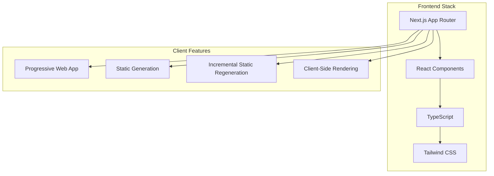

#### Component Architecture
```
src/
├── app/                      # Next.js App Router
│   ├── (public)/            # Public routes
│   │   ├── page.tsx         # Homepage
│   │   ├── properties/      # Property listings
│   │   ├── planning/        # Planning applications
│   │   ├── news/           # News section
│   │   └── areas/          # Area guides
│   ├── api/                # API routes
│   └── layout.tsx          # Root layout
├── components/
│   ├── ui/                 # Reusable UI components
│   ├── features/           # Feature-specific components
│   └── layouts/            # Layout components
├── lib/
│   ├── api/               # API client functions
│   ├── utils/             # Utility functions
│   └── hooks/             # Custom React hooks
└── types/                 # TypeScript definitions
```

### 2. Backend Services

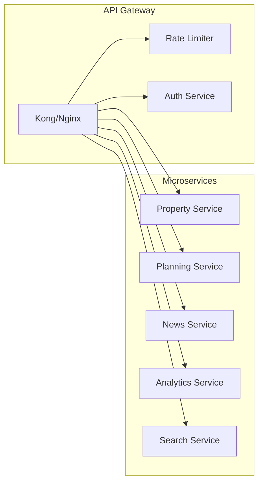

#### Service Definitions

##### Property Service
```typescript
interface PropertyService {
  // Core endpoints
  GET /properties/:id
  GET /properties/search
  GET /properties/by-postcode/:postcode
  GET /properties/:id/history
  GET /properties/:id/comparables

  // Admin endpoints
  POST /admin/properties/import
  PUT /admin/properties/:id
  DELETE /admin/properties/:id
}
```

##### Planning Service
```typescript
interface PlanningService {
  // Public endpoints
  GET /planning/applications
  GET /planning/applications/:id
  GET /planning/applications/by-property/:propertyId
  GET /planning/applications/search

  // Webhook endpoints
  POST /webhooks/planning/update

  // Admin endpoints
  POST /admin/planning/sync
}
```

##### News Service
```typescript
interface NewsService {
  // Content endpoints
  GET /news/articles
  GET /news/articles/:id
  GET /news/trending
  GET /news/by-area/:areaCode

  // AI endpoints
  POST /news/generate
  POST /news/summarize

  // Feed management
  POST /admin/feeds/add
  DELETE /admin/feeds/:id
}
```

### 3. Data Pipeline Architecture

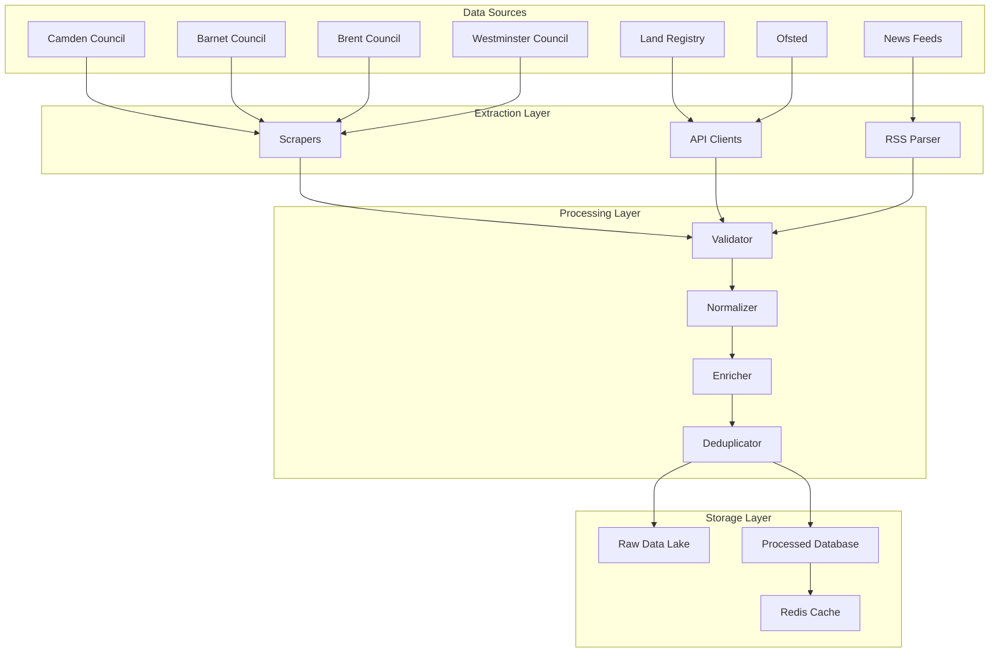

#### Data Processing Pipeline

```python
# Example scraper architecture
class CouncilScraper:
    def __init__(self, council_config):
        self.config = council_config
        self.session = self._create_session()
        self.queue = Queue()

    async def scrape(self):
        # 1. Fetch listing pages
        listings = await self.fetch_listings()

        # 2. Queue individual applications
        for listing in listings:
            self.queue.put(listing)

        # 3. Process queue with workers
        workers = [self.process_worker() for _ in range(10)]
        await asyncio.gather(*workers)

    async def process_worker(self):
        while not self.queue.empty():
            item = self.queue.get()
            data = await self.fetch_details(item)
            processed = self.normalize(data)
            await self.store(processed)
```

### 4. Database Architecture

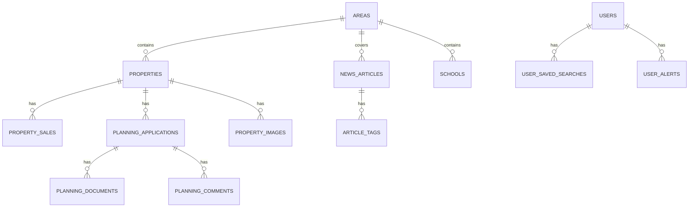

#### Database Partitioning Strategy

```sql
-- Partition planning applications by year
CREATE TABLE planning_applications (
    id BIGSERIAL,
    reference VARCHAR(50),
    submitted_date DATE,
    property_id BIGINT,
    -- other columns
    PRIMARY KEY (id, submitted_date)
) PARTITION BY RANGE (submitted_date);

-- Create yearly partitions
CREATE TABLE planning_applications_2024
    PARTITION OF planning_applications
    FOR VALUES FROM ('2024-01-01') TO ('2025-01-01');

-- Index strategy for performance
CREATE INDEX idx_planning_ref ON planning_applications(reference);
CREATE INDEX idx_planning_property ON planning_applications(property_id);
CREATE INDEX idx_planning_date ON planning_applications(submitted_date DESC);
CREATE INDEX idx_planning_status ON planning_applications(status)
    WHERE status IN ('pending', 'approved', 'refused');
```

### 5. Caching Strategy

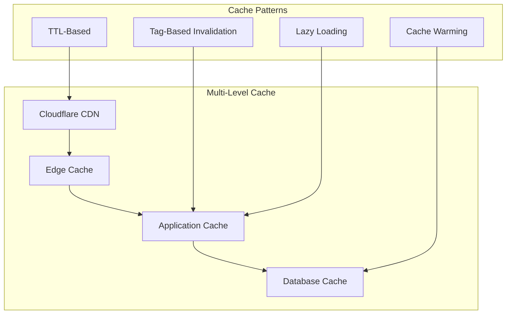

#### Cache Configuration

```typescript
// Redis cache configuration
const cacheConfig = {
  // Static content (1 week)
  static: {
    ttl: 604800,
    prefix: 'static:',
  },

  // Property data (1 day)
  properties: {
    ttl: 86400,
    prefix: 'prop:',
    tags: ['properties'],
  },

  // Planning data (4 hours)
  planning: {
    ttl: 14400,
    prefix: 'plan:',
    tags: ['planning'],
  },

  // News (1 hour)
  news: {
    ttl: 3600,
    prefix: 'news:',
    tags: ['news'],
  },

  // Search results (15 minutes)
  search: {
    ttl: 900,
    prefix: 'search:',
    maxSize: 1000,
  }
};
```

### 6. Search Infrastructure

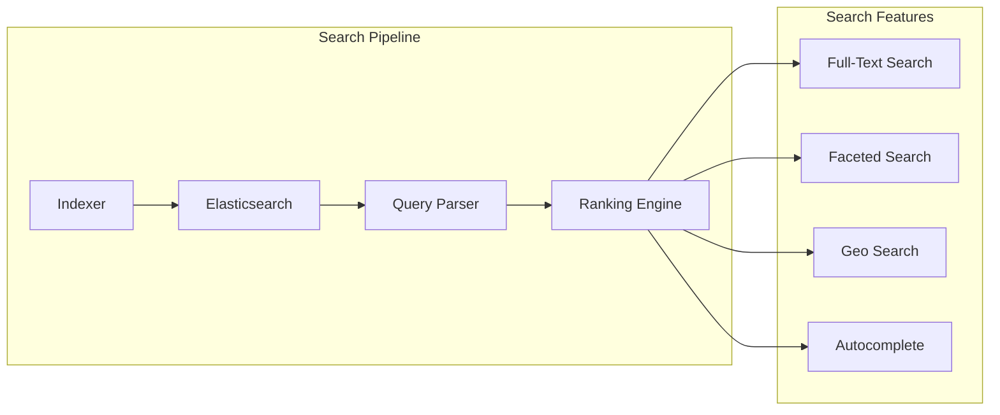

#### Elasticsearch Mapping

```json
{
  "mappings": {
    "properties": {
      "id": { "type": "keyword" },
      "address": {
        "type": "text",
        "fields": {
          "keyword": { "type": "keyword" },
          "suggest": { "type": "completion" }
        }
      },
      "postcode": { "type": "keyword" },
      "location": { "type": "geo_point" },
      "price": { "type": "long" },
      "bedrooms": { "type": "integer" },
      "property_type": { "type": "keyword" },
      "description": { "type": "text" },
      "features": { "type": "keyword" },
      "area_stats": {
        "type": "nested",
        "properties": {
          "avg_price": { "type": "long" },
          "price_change": { "type": "float" }
        }
      },
      "created_at": { "type": "date" },
      "updated_at": { "type": "date" }
    }
  }
}
```

## Data Flow Diagrams

### 1. Planning Application Data Flow

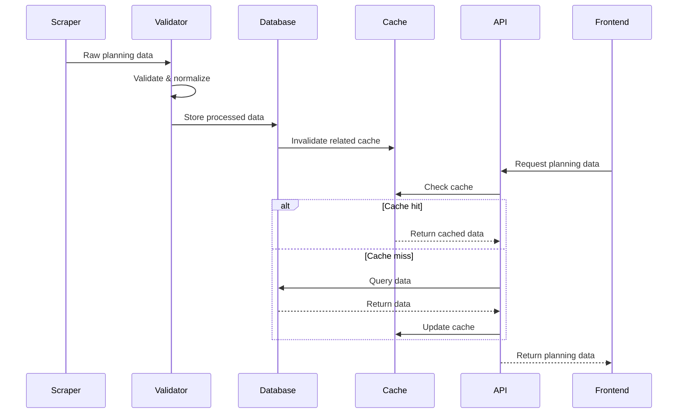

### 2. AI Content Generation Flow

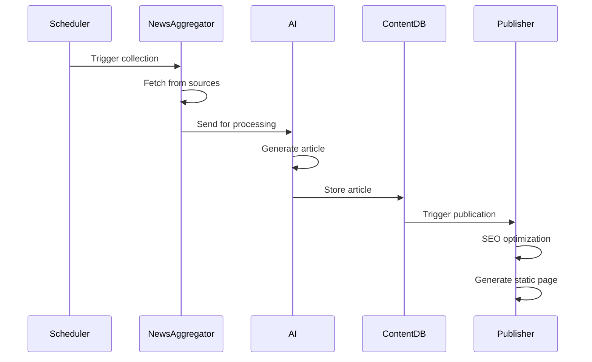

## Infrastructure Requirements

### Compute Resources

```yaml
# Production Environment
production:
  frontend:
    type: Vercel Pro
    instances: auto-scaling
    memory: 1024MB

  api_gateway:
    type: AWS ALB
    instances: 2

  microservices:
    type: AWS ECS Fargate
    services:
      - name: property-service
        cpu: 1 vCPU
        memory: 2GB
        instances: 3
      - name: planning-service
        cpu: 1 vCPU
        memory: 2GB
        instances: 3
      - name: news-service
        cpu: 2 vCPU
        memory: 4GB
        instances: 2

  data_pipeline:
    type: AWS Batch
    compute_environment:
      type: MANAGED
      desired_vcpus: 8
      max_vcpus: 32

  database:
    type: AWS RDS PostgreSQL
    instance_class: db.r6g.xlarge
    storage: 500GB SSD
    multi_az: true
    read_replicas: 2

  elasticsearch:
    type: AWS OpenSearch
    instance_type: t3.medium.elasticsearch
    instance_count: 3
    storage: 100GB per node

  redis:
    type: AWS ElastiCache
    node_type: cache.m6g.large
    num_cache_nodes: 3

# Development Environment
development:
  all_services:
    type: Docker Compose
    resources:
      cpu: 4 cores
      memory: 16GB
      storage: 100GB
```

### Network Architecture

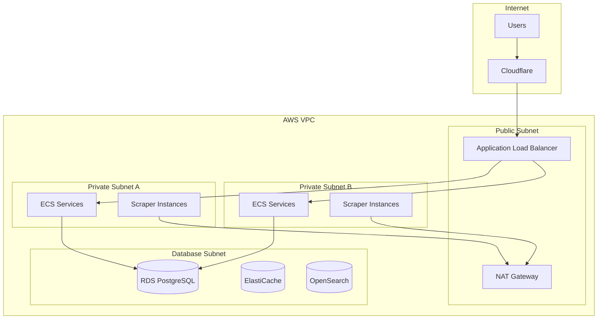

## Scalability Considerations

### Horizontal Scaling

1. **Application Layer**
   - Stateless services for easy horizontal scaling
   - Auto-scaling based on CPU/memory metrics
   - Load balancing across multiple instances

2. **Database Layer**
   - Read replicas for query distribution
   - Connection pooling with pgBouncer
   - Partitioning for large tables

3. **Caching Layer**
   - Redis Cluster for distributed caching
   - Consistent hashing for cache distribution
   - Cache warming strategies

### Vertical Scaling

1. **Database Optimization**
   - Index optimization
   - Query performance tuning
   - Materialized views for complex queries

2. **Resource Allocation**
   - Dynamic resource allocation based on load
   - Reserved capacity for predictable workloads

### Performance Targets

```yaml
performance_sla:
  api_response_time:
    p50: 100ms
    p95: 500ms
    p99: 1000ms

  page_load_time:
    first_contentful_paint: < 1.5s
    time_to_interactive: < 3.5s

  throughput:
    api_requests: 10,000 req/s
    concurrent_users: 50,000

  availability:
    uptime: 99.9%
    planned_maintenance: < 4 hours/month
```

## Security and Privacy Measures

### Security Architecture

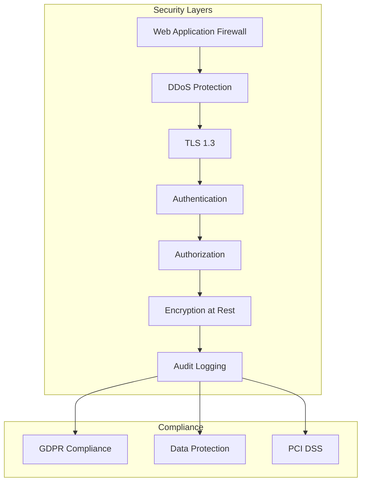

### Security Implementation

```typescript
// Security middleware stack
const securityMiddleware = [
  helmet(), // Security headers
  rateLimit({
    windowMs: 15 * 60 * 1000,
    max: 100
  }),
  cors({
    origin: process.env.ALLOWED_ORIGINS?.split(','),
    credentials: true
  }),
  compression(),
  mongoSanitize(), // Prevent injection
  xss(), // XSS protection
];

// JWT implementation
const jwtConfig = {
  accessToken: {
    secret: process.env.JWT_ACCESS_SECRET,
    expiresIn: '15m',
  },
  refreshToken: {
    secret: process.env.JWT_REFRESH_SECRET,
    expiresIn: '7d',
  },
  algorithm: 'RS256',
};

// Data encryption
const encryptionConfig = {
  algorithm: 'aes-256-gcm',
  saltLength: 64,
  tagLength: 16,
  iterations: 100000,
};
```

### Privacy Measures

1. **Data Minimization**
   - Collect only necessary data
   - Automatic data expiration
   - Anonymous analytics

2. **User Rights**
   - Data export functionality
   - Right to deletion
   - Consent management

3. **Data Protection**
   - Encrypted storage
   - Secure transmission
   - Access logging

## Monitoring and Observability

### Monitoring Stack

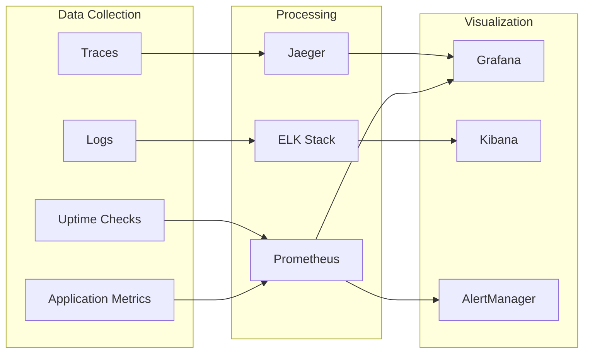

### Key Metrics

```yaml
metrics:
  business:
    - daily_active_users
    - page_views
    - search_queries
    - api_calls

  performance:
    - response_time
    - error_rate
    - throughput
    - cache_hit_rate

  infrastructure:
    - cpu_usage
    - memory_usage
    - disk_io
    - network_traffic

  data_pipeline:
    - records_processed
    - scraping_success_rate
    - data_freshness
    - processing_lag
```

## Disaster Recovery

### Backup Strategy

```yaml
backup_strategy:
  database:
    frequency: hourly snapshots
    retention: 30 days
    replication: cross-region

  application_data:
    frequency: daily
    retention: 90 days
    storage: S3 with versioning

  configuration:
    method: GitOps
    storage: Git repository

  recovery_targets:
    rto: 4 hours  # Recovery Time Objective
    rpo: 1 hour   # Recovery Point Objective
```

### Failure Scenarios

1. **Database Failure**
   - Automatic failover to standby
   - Point-in-time recovery capability
   - Regular disaster recovery drills

2. **Service Failure**
   - Circuit breaker pattern
   - Graceful degradation
   - Fallback mechanisms

3. **Data Center Failure**
   - Multi-region deployment
   - Traffic routing via Route 53
   - Data replication across regions